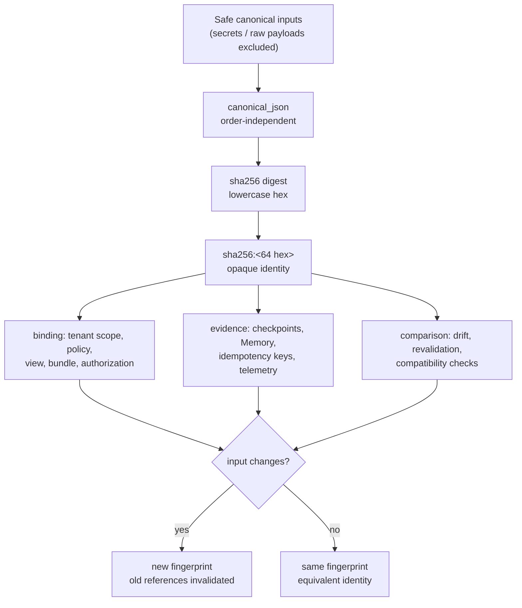

# Evidence and Fingerprints

> **Reader**: architects, security reviewers, operators, and anyone who
> needs to reason about evidence identity. **Prerequisites**:
> [Architecture overview](overview.md).

## Why

Deterministic opaque fingerprints exist because the system must be able
to **refer to** a payload — a configuration, a Semantic View, a policy, a
catalog snapshot, a compiled artifact, a workflow checkpoint, a Memory
record — without **containing** it. Fingerprints make four things
possible:

- **Reproducibility** — the same safe inputs always produce the same
  identity, across processes, workers, and runs.
- **Compatibility checks** — a changed view, bundle, policy, or catalog
  invalidates every previously recorded reference, so stale evidence can
  never silently authorize execution.
- **Authorization binding** — tenant scope, policy, view, and
  authorization artifacts are bound by fingerprint, so a substitution
  anywhere in the chain breaks the binding.
- **Cache / idempotency correlation and drift detection** — idempotency
  keys, workflow checkpoints, and snapshot comparisons correlate records
  by identity, and mismatches surface as drift.
- **Safe telemetry** — logs, evidence, and reports can carry stable
  identities without ever carrying the payloads themselves.

A fingerprint is **an opaque identity/reference, not a capability**. It
does not grant authorization, it does not expose the source payload, and
it is not reversible: SHA-256 is one-way, and the canonical form is
deliberately not a serialization of secrets or raw user material.

## What

### What is fingerprinted

| Artifact | Fingerprint covers | Where it appears |
| --- | --- | --- |
| Effective configuration | Canonical snapshot of all core fields (secrets replaced by references, never plaintext) | `config_fingerprint` on capabilities, telemetry/audit context |
| Semantic View / projection | View identity/version, model/catalog, active bundle identity/version/fingerprint, tenant scope, principal authorization, purpose, policy, adapter capabilities, feature flags | IR references, workflow evidence, Memory records |
| Semantic Model Bundle | Publish-time canonical semantic payload (descriptor, calculated fields, measures, aggregations, grain, sources, dependencies, trust semantics) | Publication identity, activation, View resolution, checkpoints |
| Accepted-assertion manifest | Approved assertion IDs, types, canonical payloads, and payload hashes, linked to one published Bundle fingerprint | Incremental rediscovery and publish equivalence checks; outside the Bundle fingerprint domain |
| Metadata snapshot | Canonical serialization sorted by object/relationship id | Ledger, activation policy, drift comparison |
| Policy scope | Canonical policy content + tenant binding | Governance facts, authorization artifacts |
| Tenant scope | Canonical trusted scope (never raw tenant/principal IDs) | Governance, workflow state, namespaces, outcomes |
| Compiled artifact | Backend-neutral compilation evidence (fingerprints only — never raw SQL/MQL) | Guard, authorization, protected results |
| Protected result | Normalized scalar rows | Outcome, idempotency records |
| Instruction bundle / output schema | Versioned instruction contract | Invocation metadata, gate evidence, evaluation evidence |

### What is deliberately excluded

Fingerprint inputs are filtered **before** hashing. The following never
enter canonicalization, fingerprints, or any downstream evidence:

- secrets, tokens, API keys, DSNs, and credentials;
- raw prompts and raw query text;
- raw queries, SQL/MQL, and executable text;
- raw result rows, documents, or provider responses;
- native objects (cursors, connections, driver values, SDK clients);
- unapproved tenant/principal identifiers and client claims.

For Bundle identity, lifecycle metadata is also excluded: assertion provenance,
review state/bindings, reviewer identities, approval chains, rejected
assertions, deployment bindings, file `apiVersion`, comments/presentation,
publish audit, activation state, and supersession links. Deployment references
may change between environments without changing semantic identity. Semantic
content, including every canonical calculated-field member, does change it.

An `AssemblyDraft` has no Bundle fingerprint. An in-memory Bundle candidate may
precompute its deterministic semantic fingerprint for validation, but that
value becomes authoritative and externally visible only inside successful
atomic publish, alongside the immutable Bundle, accepted-assertion manifest,
and audit reference. Identical semantic
content is idempotent by fingerprint; rollback reselects an existing fingerprint
and never computes a replacement.

This filtering is a **safety filter, not a lossy optimization**: inputs
containing excluded material are rejected or sanitized, and the
resulting identity says nothing about the excluded content.

## How

### Canonicalization

Before hashing, every payload is normalized into a canonical form that
is stable across mapping key insertion orders:

1. **Mappings** are sorted by key (string form) recursively.
2. **Sets/frozensets** are sorted by their canonical JSON rendering.
3. **Lists/tuples** preserve order.
4. **Datetimes** become ISO-8601 strings.
5. Scalars pass through; unsupported values become strings.

The canonical JSON rendering uses `sort_keys=True` and compact
separators, so two payloads that differ only in key order hash to the
same identity.

### Safe key-order canonicalization example

These two equivalent payloads — identical except for mapping key
insertion order — produce the **same** fingerprint:

```python
from nl2data_core.canonical import canonical_json, sha256_fingerprint

first = {"view_id": "v1", "fields": ["order_id", "amount"]}
second = {"fields": ["order_id", "amount"], "view_id": "v1"}

assert canonical_json(first) == canonical_json(second)
# '{"fields":["order_id","amount"],"view_id":"v1"}'

assert sha256_fingerprint(first) == sha256_fingerprint(second)
# 'sha256:77324b62e300929d30e7bd55cbcec7aa99d3d5f89ab995db4885027c2bc3dc69'
```

The example contains no credentials, raw prompts, queries, or results —
only safe identifiers. `sha256:<lowercase hex>` is the fixed fingerprint
format everywhere in the system.

> Note: the snippet above imports `nl2data_core` and is therefore
> **contributor-only**. Application code never computes fingerprints; it
> receives them as opaque bounded references.

### Fingerprint dependency and lifecycle



**Reader question**: where do fingerprints come from, how do they
propagate, and what happens when an input changes?

**Text equivalent**: safe canonical inputs are rendered
order-independently and hashed with SHA-256 into a fixed-format opaque
identity. That identity is used for binding (authorization artifacts,
scope), storage (evidence, idempotency keys, telemetry), and comparison
(drift, revalidation). If any input changes — a view version, a policy,
a catalog snapshot, a tenant scope — the new fingerprint invalidates
every previously recorded reference; if inputs are equivalent, the
identity is unchanged. Fingerprints never contain the source payload and
can never be reversed into it.

### Propagation

Fingerprints travel through the system as the only payload identity:

- governance facts and policy scopes carry the tenant scope fingerprint;
- the authorization issuer binds the scope fingerprint and policy
  fingerprint into the authorization artifact; the verifier re-checks
  them before execution;
- workflow checkpoints store stage name, state, tenant scope, and
  configuration/policy/catalog/semantic/artifact fingerprints — never
  raw material;
- Memory records store fingerprints of intent, IRs, artifacts, policies,
  and catalogs;
- public outcomes and handles expose only `tenant_scope_fingerprint` and
  bounded `evidence_fingerprints`.

### Mismatch handling

A fingerprint mismatch means the referenced identity is no longer what
the current context expects. The system **fails closed**:

| Mismatch | Behavior |
| --- | --- |
| Recalled Memory reference stale/out of scope | Fails closed into clarification before provider invocation |
| Checkpoint under a different resolved view | `STALE_CHECKPOINT` before any adapter execution |
| Stored IR whose derivation changed | Refused at the execute gate |
| Bundle/snapshot fingerprint drifted | `snapshot_stale` / `bundle_stale` / `catalog_stale` denial |
| Tenant scope mismatch | `TENANT_CONTEXT_REJECTED` |
| Configuration snapshot differs from expected | Protected override rejection or non-retryable configuration error |

There is **no plaintext recovery path**: a mismatch never suggests or
exposes the original payload — it denies, revalidates, or rolls back.

### Intentional version and rotation changes

Identity is versioned by construction — a new version is a new payload
with a new fingerprint:

- a new **Semantic Model Bundle version** is a new bundle with a new
  fingerprint; activation revalidates and requires declared dependencies
  with matching fingerprints;
- a **schema version** in configuration or snapshots is explicit; old
  runtimes fail closed against new deployments
  (`UNSUPPORTED_SCHEMA_VERSION`) — downgrading is a deployment decision,
  never an automatic rollback;
- a **rollback** (bundle, snapshot, or view) activates a previous
  artifact under the same policy — the new active identity invalidates
  evidence produced under the rolled-back one, and stale checkpoints are
  rejected before any adapter execution.

Rotation is safe precisely because fingerprints are deterministic
identities, not mutable state: switching versions is a comparison
problem, never a rewrite of evidence.

## Next steps

- [Verification Suite](verification-suite.md) explains plan, runner, executor,
  and publication evidence bindings that remain outside Bundle identity.

- [Governance and tenancy](governance-and-tenancy.md) — how fingerprints
  bind authorization.
- [Workflow state](workflow-state.md) — how evidence fingerprints
  persist across restarts.
- [Metadata lifecycle](metadata-lifecycle.md) — snapshot and bundle
  fingerprints and drift.
- [证据与指纹 (简体中文)](evidence-and-fingerprints.zh-CN.md) — 中文版。
