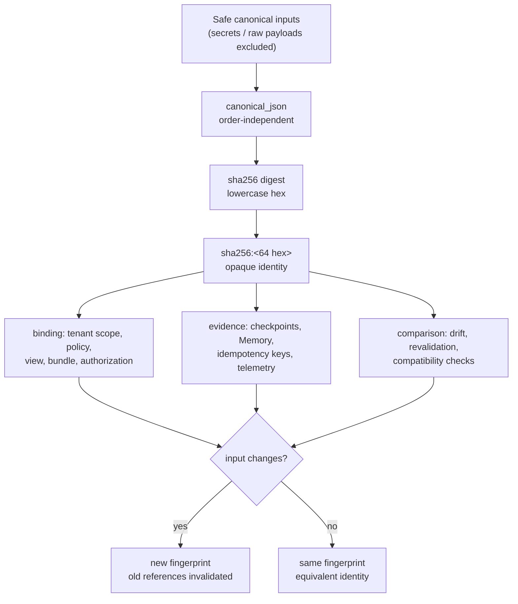

# 证据与指纹

> **本页为简体中文翻译**。规范语言为英文；如与[英文原文](evidence-and-fingerprints.md)
> 冲突，以英文为准。代码、标识符、Mermaid 图表含义与安全警告不因翻译而改变。
>
> **读者**：架构师、安全评审人员、运维人员，以及任何需要推理证据身份的人。
> **前置条件**：[架构总览](overview.md)。

## 为什么（Why）

确定性的不透明指纹之所以存在，是因为系统必须能够**引用**一个载荷——
配置、Semantic View、策略、目录快照、编译产物、工作流检查点、Memory 记录——
而无需**包含**它。指纹使四件事成为可能：

- **可复现性** — 相同的安全输入总是产生相同的身份，跨进程、跨 worker、
  跨运行。
- **兼容性检查** — 变更的视图、Bundle、策略或目录会使所有先前记录的引用
  失效，因此过期证据永远无法静默地为执行授权。
- **授权绑定** — 租户范围、策略、视图与授权工件按指纹绑定，因此链条中
  任何一处的替换都会破坏绑定。
- **缓存/幂等关联与漂移检测** — 幂等键、工作流检查点与快照比较按身份
  关联记录，不匹配即表现为漂移。
- **安全遥测** — 日志、证据与报告可以携带稳定身份，而无需携带载荷本身。

指纹是**不透明的身份/引用，而非能力**。它不授予授权，不暴露源载荷，
也不可逆：SHA-256 是单向的，且规范形式刻意不是秘密或原始用户材料的
序列化。

## 是什么（What）

### 哪些内容会被指纹化

| 工件 | 指纹覆盖范围 | 出现在哪里 |
| --- | --- | --- |
| 生效配置 | 所有核心字段的规范快照（秘密被替换为引用，绝不出现明文） | capabilities 上的 `config_fingerprint`、遥测/审计上下文 |
| Semantic View / 投影 | 视图身份/版本、模型/目录、活跃 Bundle 身份/版本/指纹、租户范围、主体授权、目的、策略、适配器能力、特性开关 | IR 引用、工作流证据、Memory 记录 |
| Semantic Model Bundle | Publish 时的 canonical semantic payload（描述符、计算字段、度量、聚合、粒度、来源、依赖与信任语义） | 发布身份、激活、View 解析、检查点 |
| Accepted-assertion manifest | 已批准 assertion 的 ID、type、canonical payload 与 payload hash，并链接到一个已发布 Bundle fingerprint | 增量 rediscovery 与 publish 等价校验；位于 Bundle fingerprint domain 之外 |
| 元数据快照 | 按对象/关系 id 排序的规范序列化 | 账本、激活策略、漂移比较 |
| 策略范围 | 规范策略内容 + 租户绑定 | 治理事实、授权工件 |
| 租户范围 | 规范受信任范围（绝不使用原始租户/主体 ID） | 治理、工作流状态、命名空间、结果 |
| 编译产物 | 后端中立的编译证据（仅指纹——绝无原始 SQL/MQL） | 守卫、授权、受保护结果 |
| 受保护结果 | 归一化标量行 | 结果、幂等记录 |
| 指令包 / 输出 schema | 带版本号的指令契约 | 调用元数据、门证据、评估证据 |

### 刻意排除的内容

指纹输入在**哈希之前**就被过滤。以下内容永远不进入规范化、
指纹或任何下游证据：

- 秘密、令牌、API 密钥、DSN 与凭据；
- 原始提示词与原始查询文本；
- 原始查询、SQL/MQL 与可执行文本；
- 原始结果行、文档或提供方响应；
- 原生对象（游标、连接、驱动值、SDK 客户端）；
- 未获批准的租户/主体标识符与客户端声明。

对于 Bundle 身份，生命周期元数据也被排除：assertion provenance、review state/binding、
reviewer identity、approval chain、rejected assertion、deployment binding、文件
`apiVersion`、注释/表现形式、publish audit、activation state 与 supersession link。
不同环境的 deployment reference 可以变化而不改变语义身份；语义内容（包括计算字段的
每个 canonical member）变化则会改变 fingerprint。

`AssemblyDraft` 没有 Bundle fingerprint。内存中的 Bundle 候选对象可以预先计算
确定性的语义 fingerprint 用于校验，但该值只有在原子 publish 成功时才成为权威且
对外可见的发布身份；此时同时持久化不可变 Bundle、accepted-assertion manifest 与 audit reference。
相同语义内容按 fingerprint 幂等；rollback 只是重新选择已有 fingerprint，不会计算新值。

这种过滤是**安全过滤器，而非有损优化**：包含被排除材料的输入会被拒绝
或消毒，且所得身份对被排除内容不透露任何信息。

## 如何（How）

### 规范化（Canonicalization）

指纹由唯一的规范化所有者 `nl2data_core.canonical` 产生的规范 JSON
字节计算而来。存在两种配置（profile）：

- **`jcs-v1`（严格，默认）**——兼容 JCS（RFC 8785）的配置：无 BOM 的
  UTF-8 JSON，对象成员按 UTF-16 码元排序，最小空白与转义，ES6 数字
  渲染（`2.0` 变为 `2`，`1e+21` 保持指数形式）。它**只**接受 JSON
  安全值：字符串键的对象、数组、字符串、整数、有限数字、布尔与 null。
- **`legacy-deterministic-json-v1`（兼容）**——历史序列化器（递归键
  排序、NFC 归一化、集合排序、ISO-8601 日期时间、未知对象的 `str()`
  强制转换）。它仅用于读取在配置元数据出现之前写入的记录；新指纹
  一律使用严格配置。

对于不含浮点整数值的 JSON 安全载荷，两种配置产生字节相同的输出，
因此黄金向量与持久化身份不会漂移。

**失败即拒绝的值。**严格配置会拒绝日期时间、集合、元组、字节、枚举、
可调用对象、异常、原生客户端、任意对象、非有限数字和非字符串对象键，
并抛出携带违规路径与类型的结构化 `CanonicalizationError`——绝不将它们
字符串化后纳入身份。

**模型准备职责。**领域模型负责归一化：`canonical_payload()` /
安全转储方法在规范化之前将日期时间转换为 ISO-8601 字符串、枚举转换为
`.value`、元组和 frozenset 转换为（排序后的）数组。规范化器从不发明
表示形式。

### 安全的键顺序规范化示例

这两个等价载荷——除映射键插入顺序外完全相同——产生**相同**的指纹：

```python
from nl2data_core.canonical import canonical_json, sha256_fingerprint

first = {"view_id": "v1", "fields": ["order_id", "amount"]}
second = {"fields": ["order_id", "amount"], "view_id": "v1"}

assert canonical_json(first) == canonical_json(second)
# '{"fields":["order_id","amount"],"view_id":"v1"}'

assert sha256_fingerprint(first) == sha256_fingerprint(second)
# 'sha256:77324b62e300929d30e7bd55cbcec7aa99d3d5f89ab995db4885027c2bc3dc69'
```

示例不含任何凭据、原始提示词、查询或结果——只有安全标识符。
`sha256:<小写十六进制>` 是系统中固定的指纹格式。

### 持久化记录中的规范化配置

持久化目录信封在 `canonicalization_profile` 成员中记录生成其存储指纹
所用的配置（新记录为 `jcs-v1`）。重新加载时：

- **没有**该成员的记录被归类为遗留配置，并在该配置下重新校验其存储
  指纹；
- 声明的**未知**配置以 `incompatible_profile` 拒绝而失败即关闭；
- 在所记录配置下**指纹不匹配**会被拒绝——重新加载绝不静默改写或重新
  推导存储身份。

测试套件中的黄金向量为代表性载荷（IR、Bundle、验证套件证据、审计
证据、目录信封、工作流快照）固定了规范字节与指纹；任何规范化变更
必须保持它们字节相同，或附带显式的配置/版本升级。

> 注意：上面的代码片段导入了 `nl2data_core`，因此**仅限贡献者**使用。
> 应用程序代码从不计算指纹；它以不透明有界引用的形式接收指纹。

### 指纹依赖与生命周期



**读者问题**：指纹从哪里来、如何传播、输入变化时会发生什么？

**文本等价描述**：安全规范输入被与顺序无关地渲染，并经 SHA-256 哈希为
固定格式的不透明身份。该身份用于绑定（授权工件、范围）、存储（证据、
幂等键、遥测）与比较（漂移、重新验证）。如果任何输入发生变化——视图版本、
策略、目录快照、租户范围——新指纹会使每个先前记录的引用失效；如果输入
等价，则身份不变。指纹绝不包含源载荷，也永远无法被逆向还原为源载荷。

### 传播

指纹作为唯一的载荷身份在系统中传播：

- 治理事实与策略范围携带租户范围指纹；
- 授权签发者将范围指纹与策略指纹绑定到授权工件中；验证者在执行前
  重新检查它们；
- 工作流检查点存储阶段名、状态、租户范围，以及配置/策略/目录/语义/
  工件指纹——绝不存原始材料；
- Memory 记录存储意图、IR、工件、策略与目录的指纹；
- 公共结果与句柄只暴露 `tenant_scope_fingerprint` 与有界的
  `evidence_fingerprints`。

### 不匹配处理

指纹不匹配意味着被引用的身份不再是当前上下文所期望的。系统
**fail-closed（安全失败）**：

| 不匹配 | 行为 |
| --- | --- |
| 召回的 Memory 引用过期/超出范围 | 在调用提供方之前 fail-closed 进入澄清 |
| 检查点处于不同的已解析视图之下 | 在任何适配器执行之前 `STALE_CHECKPOINT` |
| 存储的 IR 推导已变化 | 在 execute 门拒绝 |
| Bundle/快照指纹漂移 | `snapshot_stale` / `bundle_stale` / `catalog_stale` 拒绝 |
| 租户范围不匹配 | `TENANT_CONTEXT_REJECTED` |
| 配置快照与期望不同 | 受保护覆盖拒绝或不可重试的配置错误 |

**不存在明文恢复路径**：不匹配绝不提示或暴露原始载荷——它拒绝、
重新验证或回滚。

### 有意的版本与轮换变更

身份按构造即带版本——新版本就是带新指纹的新载荷：

- 新的 **Semantic Model Bundle 版本**是带新指纹的新 Bundle；激活会
  重新验证，并要求声明的依赖项具有匹配的指纹；
- 配置或快照中的 **schema 版本**是显式的；旧运行时对新部署
  fail-closed（`UNSUPPORTED_SCHEMA_VERSION`）——降级是部署决策，
  绝非自动回滚；
- **回滚**（Bundle、快照或视图）在同一策略下激活先前的工件——新的
  活跃身份会使回滚前产生的证据失效，过期检查点在任何适配器执行前
  被拒绝。

轮换之所以安全，正是因为指纹是确定性身份而非可变状态：切换版本是
比较问题，绝不是证据的重写。

## 下一步

- [验证套件](verification-suite.zh-CN.md)说明不进入 Bundle 身份的计划、运行器、
  执行器和发布证据绑定。

- [治理与多租户](governance-and-tenancy.md) — 指纹如何绑定授权。
- [工作流状态](workflow-state.md) — 证据指纹如何在重启后持久化。
- [元数据生命周期](metadata-lifecycle.md) — 快照与 Bundle 指纹及漂移。
- [English source](evidence-and-fingerprints.md) — 英文原文（规范）。
