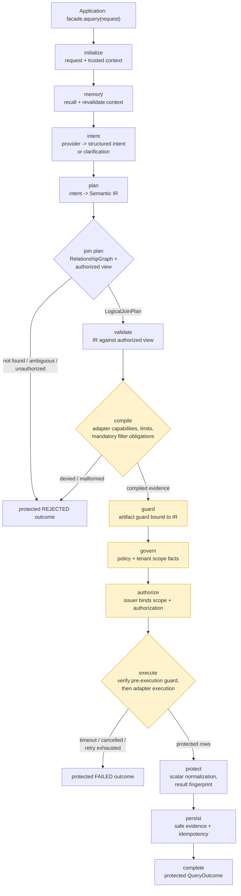

# Execution Flow

> **Reader**: architects, integrators, and security reviewers.
> **Prerequisites**: [Architecture overview](overview.md).

## The governed path of one query

Every query — with or without an AI provider — travels one ordered stage
graph. The deterministic runtime enforces the order; a future optional
backend must pass the same gate assertions before activation.

**Reader question**: what happens to a request between `facade.aquery(...)`
and the protected `QueryOutcome`, and where can it stop?

**Text equivalent**: the facade submits the request with any trusted
context. Memory recall projects and revalidates bounded context (when a
Memory provider is bound). Intent resolution converts provider output
into validated structured intent, clarification, or safe rejection —
never raw SQL/MQL/shell/AST/driver-shaped output. The plan builder
produces a Semantic IR bound to the resolved view. IR validation
re-checks every referenced member against the current authorized
projection and fails closed on excluded sources, entities, fields,
operations, aggregations, or result shapes. The compiler consumes one
immutable compilation context and emits backend-neutral evidence
carrying only fingerprints — never raw SQL/MQL, credentials, or
identity. The artifact guard, governance, and authorization stages gate
execution: the adapter is never invoked unless tenant scope, IR
validation, compilation, artifact-guard, governance, artifact
validation, authorization, and deadline evidence are all present and
fresh, re-verified immediately before execution. Execution returns
protected scalar rows; result protection normalizes and fingerprints
them; persistence stores only safe evidence and idempotency records;
completion maps to a protected public outcome.

## Stage responsibilities and owners

| Stage | Decision | Owner | Fails closed when |
| --- | --- | --- | --- |
| `initialize` | Accept request, bind trusted context | Workflow runtime | Context missing/inactive |
| `memory` | Recall bounded context only | Memory provider (optional) | Recalled reference stale/out of scope → clarification |
| `intent` | Provider output → structured intent | `IntentResolver` (core) | Unsafe output, budget exhausted |
| `plan` | Intent → Semantic IR | Plan builder (core) | Reference outside authorized view |
| `plan:join` | Multi-entity intent → LogicalJoinPlan | JoinPlanner (core) | Missing/ambiguous/unauthorized path |
| `validate` | IR against resolved view | IR validator (core) | Any referenced member excluded |
| `compile` | IR → backend-neutral evidence | Compiler (core) | Capability/limit/obligation mismatch |
| `guard` | Bind artifact guard to compiled artifact | Runtime gate | Guard/IR mismatch |
| `govern` | Policy + tenant scope evaluation | Governance evaluator (core) | Missing facts, tenant binding mismatch |
| `authorize` | Issue execution authorization | Authorization issuer (core) | Scope mismatch, revoked policy |
| `execute` | Re-verify guard, invoke adapter | Runtime + adapter | Any gate stale; deadline; fencing |
| `protect` | Normalize + fingerprint results | Runtime boundary | Unsupported native values |
| `persist` | Safe evidence + idempotency | State store (optional) | CAS conflict, stale checkpoint |
| `complete` | Protected outcome | Runtime | — |

## Multi-entity join planning

When the resolved intent carries more than one semantic entity, the runtime
invokes the deterministic `JoinPlanner` before the IR is finalized. The
planner consumes the governed `RelationshipGraph`, the `AuthorizedView`, and
the validated `MultiEntityIntent`. It returns one of four structured outcomes:

- **plan** — a backend-neutral `LogicalJoinPlan` with a stable fingerprint.
- **not_found** — no authorized path connects the required entities.
- **ambiguous** — more than one shortest authorized path exists after the
  deterministic tie-break policy.
- **unauthorized** — the relationship graph or a requested entity is outside
  the current view.

All four outcomes are fail-closed: the adapter is never invoked unless a valid
`LogicalJoinPlan` is produced and threaded through the same compile, guard,
governance, and authorization gates as single-entity plans.

## Where providers fit

A model provider is optional and plugs in at the `intent` stage behind
the `ModelProvider` port. It receives a bounded invocation request —
the user prompt **plus** an authorized context payload assembled only
from the resolved projection — and never receives database clients,
credentials, or unfiltered catalog objects. The system instruction is
owned by the core: `ModelInstructionBundle` is assembled from authorized
context, the Semantic View, policy fingerprints, and the fixed
structured-intent output contract — never from the user prompt, and user
text can never rewrite it through formatting. Without a provider, the
P1 structured-IR path and the not-configured fallback are preserved.

Without any configured runtime, the facade returns the stable
`NOT_CONFIGURED` outcome — the safe default when no workflow is bound.

## Failure classification

- **Denial** (governance, authorization, tenant, view, validation,
  compilation): stops before any external work; maps to `REJECTED`.
- **Clarification**: ambiguous input returns `CLARIFICATION` with
  bounded options; no execution happens.
- **Timeout / cancellation / retry exhaustion**: cooperative; stops
  before starting the next external operation; maps to `FAILED`.
- **Ambiguous post-execution states** (external work finished but
  terminal persistence fenced out): surfaced for reconciliation — never
  silently replayed or claimed as success.
- **Unexpected failures**: mapped to safe failed outcomes with redacted
  details; internal details never cross the public boundary.

## Next steps

- [Governance and tenancy](governance-and-tenancy.md) — the security
  decisions inside the `govern` / `authorize` gates.
- [Workflow state](workflow-state.md) — what `persist` actually stores
  and how recovery works.
- [执行流程 (简体中文)](execution-flow.zh-CN.md) — 中文执行流程。
