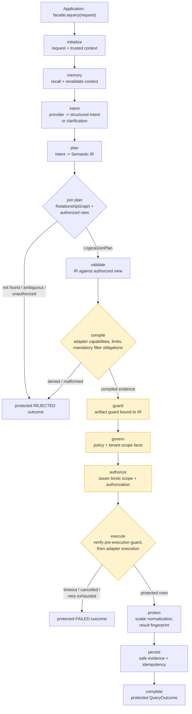

# 执行流程

> **本页为简体中文翻译**。规范语言为英文；如与[英文原文](execution-flow.md)
> 冲突，以英文为准。代码、标识符、Mermaid 图表含义与安全警告不因翻译而改变。
>
> **读者**：架构师、集成者与安全评审人员。**前置条件**：
> [架构总览](overview.md)。

## 单个查询的受治理路径

每个查询——无论是否使用 AI 提供方——都走同一条有序的阶段图。确定性运行时
强制顺序；未来可选的第三方后端必须在激活前通过相同的门断言。

**读者问题**：从 `facade.aquery(...)` 到受保护的 `QueryOutcome` 之间，
请求发生了什么，又可能在何处停止？

**文本等价描述**：门面连同任何受信任上下文提交请求。内存召回在绑定
Memory 提供方时投影并重新验证有界上下文。意图解析将提供方输出转换为
经过验证的结构化意图、澄清请求或安全拒绝——绝不允许原始 SQL/MQL/
shell/AST/驱动形态的输出。计划构建器生成绑定到已解析视图的 Semantic IR。
IR 验证会对照当前授权投影重新检查每个被引用的成员，并在被排除的源、
实体、字段、操作、聚合或结果形状上 fail-closed。编译器消费一个不可变的
编译上下文，输出仅携带指纹的后端中立证据——绝不包含原始 SQL/MQL、
凭据或身份。工件守卫、治理与授权阶段对执行设门：除非租户范围、IR 验证、
编译、工件守卫、治理、工件验证、授权与截止时间证据全部存在且新鲜，
并在执行前立即重新验证，否则适配器绝不被调用。执行返回受保护的标量行；
结果保护对其进行归一化与指纹化；持久化只存储安全证据与幂等记录；
完成阶段映射为受保护的公共结果。

## 阶段职责与所有者

| 阶段 | 决策 | 所有者 | 何时 fail-closed |
| --- | --- | --- | --- |
| `initialize` | 接受请求，绑定受信任上下文 | 工作流运行时 | 上下文缺失/不活跃 |
| `memory` | 仅召回有界上下文 | 内存提供方（可选） | 召回引用过期/超出范围 → 澄清 |
| `intent` | 提供方输出 → 结构化意图 | `IntentResolver`（核心） | 不安全输出、预算耗尽 |
| `plan` | 意图 → Semantic IR | 计划构建器（核心） | 引用超出授权视图 |
| `plan:join` | 多实体意图 → LogicalJoinPlan | JoinPlanner（核心） | 路径缺失/歧义/未授权 |
| `validate` | IR 对照已解析视图 | IR 验证器（核心） | 任何被引用成员被排除 |
| `compile` | IR → 后端中立证据 | 编译器（核心） | 能力/限制/义务不匹配 |
| `guard` | 将工件守卫绑定到编译产物 | 运行时门 | 守卫/IR 不匹配 |
| `govern` | 策略 + 租户范围评估 | 治理评估器（核心） | 事实缺失、租户绑定不匹配 |
| `authorize` | 签发执行授权 | 授权签发者（核心） | 范围不匹配、策略被撤销 |
| `execute` | 重新验证守卫，调用适配器 | 运行时 + 适配器 | 任一门过期；截止时间；围栏 |
| `protect` | 归一化 + 指纹化结果 | 运行时边界 | 不支持的原生值 |
| `persist` | 安全证据 + 幂等 | 状态存储（可选） | CAS 冲突、过期检查点 |
| `complete` | 受保护结果 | 运行时 | — |

## 多实体连接规划

当已解析意图携带多个语义实体时，运行时在 IR 定稿之前调用确定性的
`JoinPlanner`。规划器消费受治理的 `RelationshipGraph`、`AuthorizedView` 与
已校验的 `MultiEntityIntent`，返回四种结构化结果之一：

- **plan** —— 携带稳定 fingerprint 的后端中立 `LogicalJoinPlan`。
- **not_found** —— 不存在连接所需实体的已授权路径。
- **ambiguous** —— 确定性平局裁决之后仍存在多条最短已授权路径。
- **unauthorized** —— 关系图或请求的实体超出当前视图。

四种结果全部 fail-closed：除非产生有效的 `LogicalJoinPlan` 并像单实体计划
一样穿过相同的 compile、guard、govern 与 authorize 门禁，适配器绝不被调用。

## 提供方在哪里

模型提供方是可选的，在 `intent` 阶段通过 `ModelProvider` 端口接入。
它接收到的是有界的调用请求——用户提示词**加上**仅由已解析投影组装的
授权上下文载荷——并且绝不会收到数据库客户端、凭据或未过滤的目录对象。
系统指令归核心所有：`ModelInstructionBundle` 由授权上下文、Semantic View、
策略指纹与固定的结构化意图输出契约组装——绝不来自用户提示词，用户文本
也永远无法通过格式化改写它。没有提供方时，P1 结构化 IR 路径与
not-configured 回退仍然保留。

未配置任何运行时的情况下，门面返回稳定的 `NOT_CONFIGURED` 结果——
未绑定工作流时的安全默认。

## 失败分类

- **拒绝**（治理、授权、租户、视图、验证、编译）：在任何外部工作之前
  停止；映射为 `REJECTED`。
- **澄清**：输入有歧义时返回 `CLARIFICATION` 及有界选项；不发生执行。
- **超时 / 取消 / 重试耗尽**：协作式；在开始下一个外部操作之前停止；
  映射为 `FAILED`。
- **执行后状态模糊**（外部工作已完成但终态持久化被围栏拒绝）：交由
  对账处理——绝不静默重放或声称成功。
- **意外失败**：映射为安全失败结果并打码细节；内部细节永不跨越公共边界。

## 下一步

- [治理与多租户](governance-and-tenancy.md) — `govern` / `authorize`
  门内的安全决策。
- [工作流状态](workflow-state.md) — `persist` 实际存储什么、
  恢复如何工作。
- [验证套件](verification-suite.zh-CN.md) — 本流程的发布期对应物：
  Bundle 候选在发布前如何获得通过的验证证据。
- [English source](execution-flow.md) — 英文原文（规范）。
