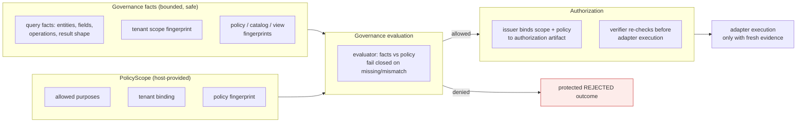
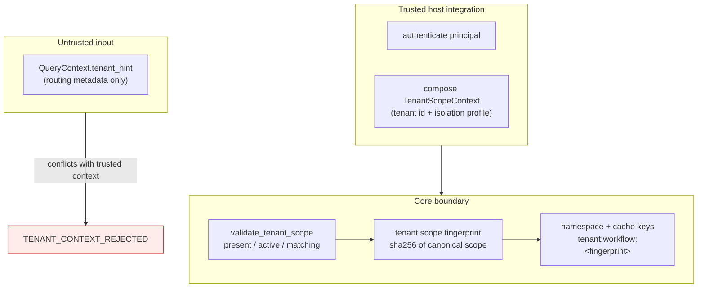

# Governance, Authorization, and Tenant Isolation

> **Reader**: security reviewers, architects, and operators.
> **Prerequisites**: [Execution flow](execution-flow.md).

## Decision ownership

Governance and authorization are **core-owned decisions**. No compiled
artifact, provider output, client hint, or stored record can grant
authority by itself. The order is fixed and enforced by the runtime:

**Reader question**: who decides whether a request may execute, and what
stops an artifact or a stored record from granting access on its own?

**Text equivalent**: the runtime assembles bounded governance facts —
including the tenant scope fingerprint and policy/catalog/view
fingerprints — and evaluates them against the host-provided policy
scope. Missing facts, tenant binding mismatches, and stale fingerprints
fail closed into a protected `REJECTED` outcome before any external work.
Only an allowed evaluation proceeds to authorization: the issuer binds
the scope and policy to an authorization artifact, and the verifier
re-checks it — along with IR validation, compilation, artifact-guard,
artifact validation, and deadline evidence — immediately before adapter
execution.

## Tenant isolation

Tenant scope is established **only** from trusted host-integration
input, never from client-supplied claims:

**Reader question**: how is tenant isolation enforced, and why can a
client hint never establish access?

**Text equivalent**: the host authenticates the principal and composes a
trusted `TenantScopeContext` with an isolation profile (`pooled`,
`schema_isolated`, `database_isolated`, `deployment_isolated`). The core
validates the context fail-closed: missing context, inactive tenant
lifecycle states, unknown or unsupported isolation profiles, and client
hints that conflict with the trusted context are denied before any
adapter execution with `TENANT_CONTEXT_REJECTED`. The trusted scope
travels only as a deterministic SHA-256 scope fingerprint through
governance facts, policy scopes, execution authorization, workflow
state, telemetry, and tenant-scoped namespace/cache keys. Raw tenant
IDs, principal IDs, delegation actors, entitlement claims, and client
hints are never persisted or exposed; outcomes expose only the bounded
opaque `tenant_scope_fingerprint` reference.

## Trust boundaries

| Boundary | What may cross it | What never crosses it | Owner of the decision |
| --- | --- | --- | --- |
| Host → core | Trusted subject + tenant context | Raw credentials, client claims | Host authentication |
| Client → core | `QueryRequest`, untrusted `tenant_hint` | Authorization-relevant claims | Core (hint is routing metadata only) |
| Provider → core | Structured output (bounded) | Raw SQL/MQL, credentials, unfiltered catalog objects | `IntentResolver` |
| Core → adapter | Compiled evidence + authorization | Raw policy internals, hidden policy material | Runtime gates |
| Adapter → core | Protected scalar rows | Native cursors, connections, driver values | Result protection |
| Core → public | `QueryOutcome`, fingerprints, error records | Raw prompts, queries, results, identity | Facade boundary |
| State store → core | Canonical safe snapshots | Raw payload fields (rejected on write and read) | Snapshot validation |

## Tenant isolation profiles

| Profile | Minimum enforcement obligation |
| --- | --- |
| `pooled` | Mandatory tenant predicates on every query |
| `schema_isolated` | Separate schema per tenant |
| `database_isolated` | Separate database per tenant |
| `deployment_isolated` | Separate deployment per tenant |

The profile declares the **minimum** obligations the host must
guarantee. Missing or unsupported profile data denies tenant-scoped
execution instead of silently downgrading.

## Isolation guarantees

- Tenant-scoped workflows are isolated in opaque
  `tenant:workflow:<fingerprint>` namespaces; unscoped lookups can never
  observe scoped records.
- Stale or out-of-scope Memory records and checkpoints fail closed.
- Cross-tenant reuse of records, policies, or checkpoints is denied by
  scope mismatch — never by trusting a stored scope claim.

## Next steps

- [Workflow state](workflow-state.md) — how ownership and fencing
  protect state across workers.
- [Verification suite](verification-suite.md) — the publication-time
  counterpart of these decisions: how a bundle candidate earns passing
  evidence before release.
- [Assembly audit evidence](../reference/assembly-audit-evidence.md) —
  the durable trail that records why each publication decision was made.
- [Evidence and fingerprints](evidence-and-fingerprints.md) — what the
  fingerprints used above actually are.
