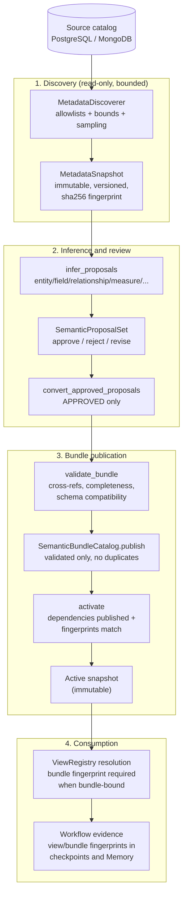

# Metadata Discovery, Review, and Bundle Lifecycle

> **Reader**: data platform engineers and maintainers. **Prerequisites**:
> [Architecture overview](overview.md).

## The lifecycle at a glance

Metadata flows from a source catalog to an activated Semantic Model
Bundle through four explicit phases. **Inference is never authority**:
only approved proposals become bundle inputs, and only trusted
View/governance resolution grants access.

**Reader question**: how does raw catalog structure become an activated
bundle that gates query execution, and where can the pipeline stop?

**Text equivalent**: discovery reads the source catalog read-only,
bounded by allowlists and limits, and produces an immutable, versioned
`MetadataSnapshot` with a canonical SHA-256 fingerprint. Inference
derives proposals (entities, fields, relationships, measures, grain,
aliases, classifications) with method, evidence, confidence, trust, and
freshness attached. The review workflow supports explicit
`approve`/`reject`/`revise`; **only `APPROVED` proposals convert** into
bundle inputs — PENDING/REJECTED/REVISED facts never become bundle
inputs, never grant View visibility, and never create mandatory filters
or execution authorization. Publication validates structure and
completeness, rejects duplicate versions, activates atomically (every
declared dependency must be published with a matching fingerprint), and
exposes an immutable active snapshot. View resolution bound to the
bundle requires a matching `bundle_fingerprint` in the resolution
context; workflow checkpoints and Memory records carry the view/bundle
identity so a changed bundle invalidates every previously recorded
reference.

## Trust levels

Every discovered fact carries a trust marker:

| Trust | Meaning |
| --- | --- |
| `declared` | Stated by the source schema |
| `observed` | Sampled (e.g. MongoDB dotted paths; may be `observed_incomplete`) |
| `inferred` | Derived by inference |

Trust is **metadata, never authority**: inferred facts may be retained
but can never independently grant View visibility or execution
authority.

## Schema drift

Drift is detected by comparing two compatible snapshots and classified
by severity:

| Severity | Examples | Default action |
| --- | --- | --- |
| `informational` | Unreferenced additions | None |
| `warning` | Unreferenced removals, type changes | Reported |
| `blocking` | Referenced removals, referenced type/constraint changes, source identity or catalog changes, expired freshness | Rejects activation |

Failure modes when drift occurs:

- `validate_bundle(..., expected_snapshot_fingerprint=...)` rejects
  unbound (`snapshot_unbound`) or stale (`snapshot_stale`) bundles
  before activation.
- View resolution fails closed with `catalog_stale` when the trusted
  catalog fingerprint drifted.
- SQL/MongoDB adapters bound to a snapshot reject mismatched artifacts
  with `SQLAdapterError`/`MongoAdapterError` before any execution.
- Stale snapshot/bundle evidence fails closed in View resolution
  (`snapshot_stale`/`bundle_stale`), and stale workflow checkpoints are
  rejected before any adapter execution.

An explicit `DriftOverride` permits exactly one decision (by canonical
decision fingerprint), is scoped to one tenant and one source, carries a
bounded safe reason, and may expire. It can never widen an allowlist or
authorize anything outside its decision.

## Retention and activation policy

- Snapshots are host-owned, process-local evidence (`SnapshotLedger`);
  only complete snapshots activate by default. Bounded/partial snapshots
  register as `partial` and are rejected on activation unless an
  explicit `allow_partial` policy accepts them.
- `cleanup_expired` drops records past their retention window (default
  30 days), including an expired active snapshot — an expired snapshot
  stops resolving until a fresh run registers and activates a
  replacement. A failed or unauthorized run never replaces the active
  snapshot.
- Activation requires an explicit `SnapshotActivationPolicy` (freshness
  bound, tenant/source scope, compatible catalog fingerprints,
  partial-snapshot tolerance) and fails closed on `snapshot_unavailable`,
  `snapshot_unauthorized`, `source_changed`, `catalog_incompatible`,
  `snapshot_partial`, `snapshot_stale`, and `blocking_drift`.

## Manual fallback and rollback

- Discovery is **optional**: manually authored descriptors/bundles and
  adapters without snapshot bindings keep working unchanged
  (`expected_snapshot_fingerprint=None`).
- To roll back an activation, activate a previous registered snapshot
  under the same policy, or re-register and re-activate the prior
  discovery snapshot.

## Operational evidence

Every failure is normalized into a safe `DiscoveryOutcome` category
(`unavailable`, `unauthorized`, `bounds_exceeded`, `discovery_failed`)
with bounded counts, duration, truncation flags, and fingerprints —
never driver text, DSNs, credentials, raw rows, or sampled values.
`sensitive_name_markers` counts objects/fields whose names match a
marker but never names them in evidence.

## Next steps

- [Metadata to active Bundle](../guides/metadata-to-bundle.md) — user-facing
  walkthrough of ownership, review, storage, and references.
- [Evidence and fingerprints](evidence-and-fingerprints.md) — how
  snapshot and bundle fingerprints are computed.
- [Service configuration](../operations/services.md) — real discovery
  profiles for PostgreSQL and MongoDB.
- [Troubleshooting](../operations/troubleshooting.md) — stale snapshots
  and drift recovery.
