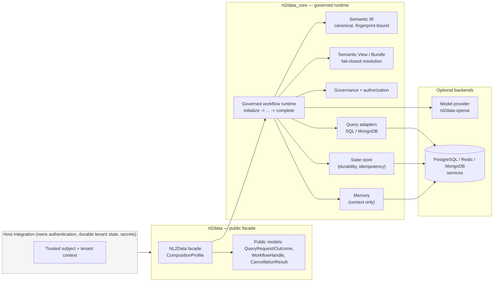

# Architecture Overview

> **Reader**: architects, security reviewers, and maintainers.
> **Prerequisites**: basic knowledge of the public API
> ([Quickstart](../getting-started/quickstart.md)).

## What the system is

NL2Data is a governed and extensible Python framework for
natural-language access to heterogeneous enterprise data. One public
facade (`nl2data`) composes a chain of internal boundaries — Semantic
IR, Semantic View / Bundle, a deterministic governed workflow runtime,
and optional database, memory, and model-provider backends — so that
**no external work happens before validation, governance,
authorization, and result protection have all passed**.

The architecture answers three questions for every request:

1. **Who owns the decision?** — The core owns system instructions,
   compilation, governance, authorization, and result protection.
   Vendors own only transport mapping; hosts own authentication and
   durable tenant state.
2. **What crosses a boundary?** — Only protected, bounded values:
   fingerprints, safe identifiers, normalized error records, and scalar
   result rows. Raw prompts, SQL/MQL, credentials, and native objects
   never cross a boundary.
3. **What happens on failure?** — Everything fails closed: missing
   context, stale evidence, mismatched fingerprints, and unsupported
   versions deny execution before any adapter or provider work.

## Layer map

| Layer | Package | Status |
| --- | --- | --- |
| Public facade | `nl2data` | Public, stable |
| Internal implementation | `nl2data_core` (config, adapters, ai, workflow, memory, metadata, views, bundles, governance, tenancy, telemetry, plugins) | Contributor-only |
| Optional query adapters | `nl2data_core.adapters` (SQL) | Optional extra (`sql`) |
| Optional MongoDB adapter | `nl2data_mongodb` (sibling distribution) | Separate package |
| Optional workflow state backend | `nl2data_workflow_postgres` (sibling distribution) | Separate package |
| Optional Memory backend | `nl2data_memory_redis` (sibling distribution) | Separate package |
| Optional model provider | `nl2data_openai` (sibling distribution) | Separate package |

## Boundary map

**Reader question**: which components exist, who owns them, and where do
trust boundaries sit?

**Text equivalent**: a host authenticates users and composes a trusted
tenant/subject context. Applications interact only with the `nl2data`
facade, which delegates every query to the governed workflow runtime.
That runtime resolves the authorized view, validates and compiles the
Semantic IR, applies governance and authorization, executes through an
adapter, protects results, and persists safe evidence. Optional model
providers and service backends (PostgreSQL, Redis, MongoDB) are reached
only through the core boundaries and are never required for the base
library to import or construct.

## Trust boundaries (summary)

| Boundary | Decision owned by | Never decided by |
| --- | --- | --- |
| Authentication | Host integration | Client claims, `QueryRequest`, prompts |
| Tenant scope | Host-provided trusted context | `tenant_hint` (untrusted routing metadata) |
| View resolution | `ViewRegistry` (fail-closed) | Provider output, client hints |
| Compilation | Core compilers | Adapters, providers |
| Governance / authorization | Core runtime gates | Compiled artifacts themselves |
| Result protection | Core boundary | Native driver code |
| Instruction content | `ModelInstructionBundle` (core) | User prompts, vendor SDKs |

## Why diagrams have text equivalents

Every diagram in this documentation set states the **reader question** it
answers and is accompanied by a **non-visual text equivalent**, so the
diagram is never the sole representation of a contract. Diagrams are
source-controlled Mermaid blocks — reviewable in pull requests and
structurally checked in CI.

## Pages in this section

- [Execution flow](execution-flow.md) — the path of one request through
  every stage, from prompt to protected result.
- [Package boundaries](package-boundaries.md) — public/internal imports
  and optional dependency loading.
- [Governance and tenancy](governance-and-tenancy.md) — who may decide,
  and how tenant isolation is enforced.
- [Workflow state](workflow-state.md) — leases, fencing, idempotency,
  persistence, and at-least-once semantics.
- [Metadata lifecycle](metadata-lifecycle.md) — discovery, inference,
  review, Bundle publication, and schema drift.
- [Evidence and fingerprints](evidence-and-fingerprints.md) — why
  fingerprints exist, what they cover, and how they are computed.
- [架构总览 (简体中文)](overview.zh-CN.md) — 中文架构总览。
