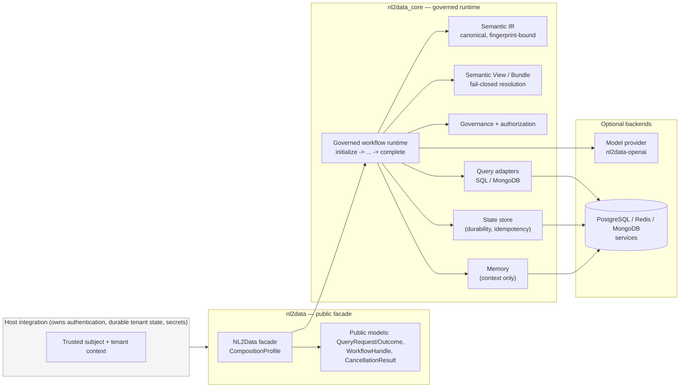

# 架构总览

> **本页为简体中文翻译**。规范语言为英文；如与[英文原文](overview.md)冲突，
> 以英文为准。代码、标识符、Mermaid 图表含义与安全警告不因翻译而改变。
>
> **读者**：架构师、安全评审人员与维护者。**前置条件**：了解公共 API 基础
> （[快速上手](../getting-started/quickstart.md)）。

## 系统是什么

NL2Data 是一个受治理、可扩展的 Python 框架，用于以自然语言访问异构企业数据。
一个公共门面（`nl2data`）组合了一条内部边界链——Semantic IR、Semantic View /
Bundle、确定性的受治理工作流运行时，以及可选的数据库、内存与模型提供方后端——
从而保证**在验证、治理、授权与结果保护全部通过之前，不发生任何外部工作**。

架构为每个请求回答三个问题：

1. **决策归谁所有？** — 核心拥有系统指令、编译、治理、授权与结果保护。
   供应商只拥有传输映射；宿主拥有认证与持久化租户状态。
2. **什么会跨越边界？** — 只有受保护、有界的值：指纹、安全标识符、
   归一化错误记录与标量结果行。原始提示词、SQL/MQL、凭据与原生对象
   永不跨越边界。
3. **失败时会发生什么？** — 一切皆 fail-closed（安全失败）：上下文缺失、
   证据过期、指纹不匹配、版本不受支持，都会在任何适配器或提供方工作
   之前拒绝执行。

## 分层图

| 层 | 包 | 状态 |
| --- | --- | --- |
| 公共门面 | `nl2data` | 公共、稳定 |
| 内部实现 | `nl2data_core`（config、adapters、ai、workflow、memory、metadata、views、bundles、governance、tenancy、telemetry、plugins） | 仅限贡献者 |
| 可选查询适配器 | `nl2data_core.adapters`（SQL） | 可选 extra（`sql`） |
| 可选 MongoDB 适配器 | `nl2data_mongodb`（兄弟发行包） | 独立包 |
| 可选工作流状态后端 | `nl2data_workflow_postgres`（兄弟发行包） | 独立包 |
| 可选内存后端 | `nl2data_core.memory.RedisMemoryProvider` | 可选 extra（`redis`） |
| 可选模型提供方 | `nl2data_openai`（兄弟发行包） | 独立包 |

## 边界图

**读者问题**：存在哪些组件、归谁所有、信任边界在哪里？

**文本等价描述**：宿主对用户进行认证，并组合出受信任的租户/主体上下文。
应用程序只与 `nl2data` 门面交互，门面将每个查询委托给受治理的工作流运行时。
该运行时解析已授权的视图，验证并编译 Semantic IR，应用治理与授权，
通过适配器执行，保护结果，并持久化安全证据。可选模型提供方与服务后端
（PostgreSQL、Redis、MongoDB）只能通过核心边界触达，基础库的导入与
构造永远不要求它们存在。

## 信任边界（摘要）

| 边界 | 决策所有者 | 绝不由其决定 |
| --- | --- | --- |
| 认证 | 宿主集成 | 客户端声明、`QueryRequest`、提示词 |
| 租户范围 | 宿主提供的受信任上下文 | `tenant_hint`（不受信任的路由元数据） |
| 视图解析 | `ViewRegistry`（fail-closed） | 提供方输出、客户端提示 |
| 编译 | 核心编译器 | 适配器、提供方 |
| 治理 / 授权 | 核心运行时门 | 编译产物本身 |
| 结果保护 | 核心边界 | 原生驱动代码 |
| 指令内容 | `ModelInstructionBundle`（核心） | 用户提示词、供应商 SDK |

## 为什么图表要带文本等价描述

本文档集中的每张图表都说明其回答的**读者问题**，并附有**非视觉文本等价
描述**，因此图表永远不会是契约的唯一表述。图表是纳入版本控制的 Mermaid
块——可在拉取请求中评审，并在 CI 中进行结构性检查。

## 本分区页面

- [执行流程](execution-flow.md) — 一个请求从提示词到受保护结果的
  全阶段路径。
- [包边界](package-boundaries.md) — 公共/内部导入与可选依赖加载。
- [治理与多租户](governance-and-tenancy.md) — 谁可以决策，
  以及租户隔离如何强制执行。
- [工作流状态](workflow-state.md) — 租约、围栏（fencing）、幂等、
  持久化与 at-least-once 语义。
- [元数据生命周期](metadata-lifecycle.md) — 发现、推断、评审、
  Bundle 发布与 schema 漂移。
- [证据与指纹](evidence-and-fingerprints.md) — 指纹为何存在、
  覆盖什么、如何计算。
- [English source](overview.md) — 英文原文（规范）。
