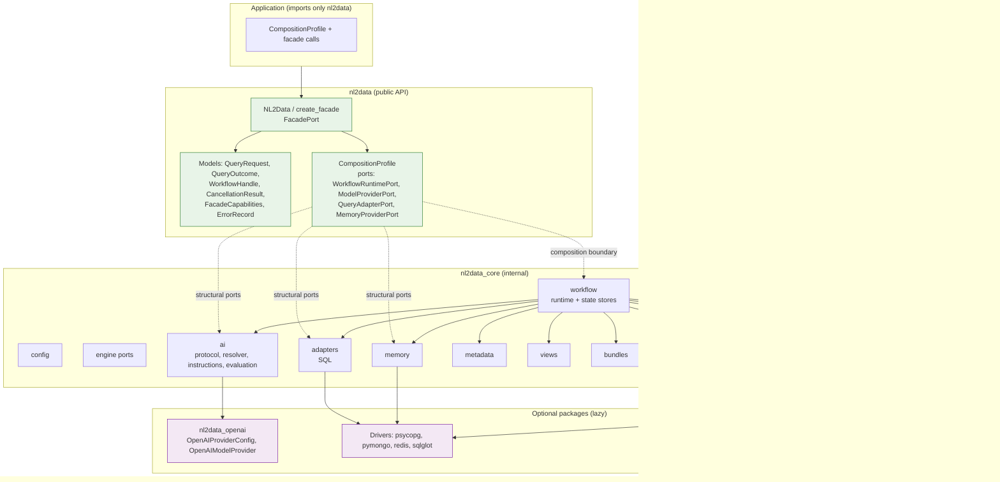

# Package Boundaries

> **Reader**: integrators and contributors. **Prerequisites**:
> [Architecture overview](overview.md).

## Two distributions, two layers

The repository ships **two distributions**:

| Distribution | Public import | Purpose |
| --- | --- | --- |
| `nl2data-core` | `nl2data` (public), `nl2data_core` (internal, contributor-only) | The governed library |
| `nl2data-openai` | `nl2data_openai` | Optional OpenAI structured-output provider |

Applications import **only** `nl2data`. `nl2data_core` is internal: it
exists so optional providers can be plugged in without leaking into the
public surface. Direct application imports from `nl2data_core` are
deprecated; migrate through the facade.

## Component / package boundary diagram

**Reader question**: which packages may import which, and where do
optional dependencies load?

**Text equivalent**: the application talks to the public facade, which
exposes public models and accepts a typed composition profile. The
facade composes the internal runtime across the composition boundary;
structural ports (`WorkflowRuntimePort`, `ModelProviderPort`,
`QueryAdapterPort`, `MemoryProviderPort`) let internal implementations
satisfy the public shape without the application importing `nl2data_core`
or any backend type. Internal packages (workflow, ai, adapters, memory,
metadata, views, bundles, governance, tenancy, telemetry, plugins)
depend on each other through narrow contracts, and only they may import
optional drivers or the sibling OpenAI package — lazily, at client build
time.

## Import rules

| Rule | Enforced by |
| --- | --- |
| `nl2data` never imports optional backends (database drivers, LLM SDKs, HTTP frameworks, telemetry backends) | AST-based import-boundary tests + `sys.modules` checks |
| Applications import only `nl2data` public symbols | `tests/contract/test_public_imports.py` conformance |
| Documentation examples follow the same public boundary | `scripts/check_docs.py` smoke checks |
| Optional packages import their SDK lazily — never at package import | `tests/security/test_import_boundary.py` |
| No driver/SDK type enters the public API or framework-neutral contracts | import-boundary suite |

## Optional dependency loading

Constructing a facade imports no optional modules. The loading points
are explicit:

| Module | Loaded when |
| --- | --- |
| Model provider (e.g. `nl2data_openai`) | First `generate()` call — never at import, construction, or capability inspection |
| Database drivers (psycopg, pymongo, redis, sqlglot) | First real-service client build |
| Workflow runtime composition | `initialize()` — the earliest point optional modules load |

This is why the base library works with **no** extras installed: the
public API, models, configuration, and the deterministic runtime import
only `pydantic` and `PyYAML`. The `not-configured` fallback and the
deterministic fake provider (`FakeModelProvider`) need no credentials and
no network access.

## Configuration and telemetry are internal

- Configuration loads through the public `load_config`; the typed
  configuration model remains internal until a public configuration API
  ships.
- Telemetry/audit ports are internal contracts with in-memory sinks;
  application code composes a `TelemetryPort` if it wants to observe
  audit events — internal details stay bounded and redacted.

## Future hosting boundary

A later `nl2data_http` package (out of scope) may host the library
behind HTTP. The boundary is already fixed: it will program against the
transport-neutral `FacadePort` and the public models without importing
internal types. The core adds no HTTP dependency and never loads
`fastapi`, `flask`, or `starlette`.

## Next steps

- [Governance and tenancy](governance-and-tenancy.md) — trust boundaries
  inside the core.
- [Adding an adapter or provider](../development/adding-adapter-or-provider.md)
  — how new backends plug in without bypassing these boundaries.
