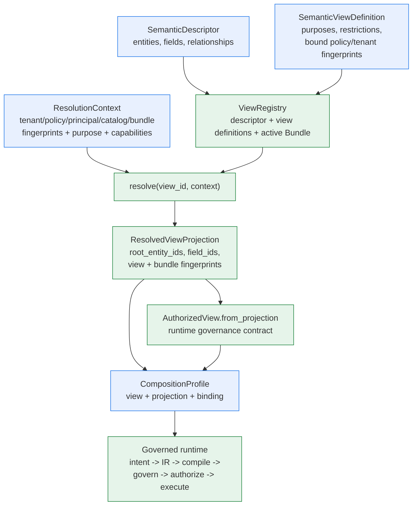

# Semantic Layer: Descriptors, Views, Projections, and Composition

> **Reader**: architects, security reviewers, and application integrators.
> **Prerequisites**: [Architecture overview](overview.md) and the
> [Metadata lifecycle](metadata-lifecycle.md).
>
> [简体中文](semantic-layer.zh-CN.md)

The semantic layer is the boundary between what a source *is* (physical
tables and columns) and what an application is *allowed to ask* (semantic
entities, fields, and relationships under governance). It exists so the
query path never depends on raw schema, never invents semantics, and can
fail closed on every trust dimension before any adapter executes.

## Artifacts and ownership

| Artifact | Owned by | Carries | Role |
| --- | --- | --- | --- |
| `SemanticDescriptor` | Metadata lifecycle (discovery + inference + review) or manual authoring | Entities, fields, relationships, `catalog_fingerprint` | The bounded semantic vocabulary of one source; field ids are unique across entities |
| `SemanticModelBundle` | Lifecycle publication | Validated descriptor + approved semantics, active snapshot identity | Immutable release unit; activation requires dependency and fingerprint checks |
| `SemanticViewDefinition` | Lifecycle or manual authoring | Allowed purposes, member restrictions, bound policy/tenant/principal fingerprints, capabilities, feature flags | The *contract*: which parts of the descriptor a caller may see under which trusted context |
| `ViewRegistry` + `ResolutionContext` | Host composition layer | Registry holds descriptors, definitions, and the active Bundle; context carries trusted fingerprints | Resolution: every security dimension is checked before any projection is returned |
| `ResolvedViewProjection` | `ViewRegistry.resolve(...)` | `root_entity_ids`, `field_ids`, resolved entities, allowed operations/relationships, view + Bundle fingerprints | The query-time handoff: the single source of truth for the authorized surface |
| `AuthorizedView` | `AuthorizedView.from_projection(projection)` or manual | `source_id`, `root_entity_ids`, `field_ids`, optional view binding | The runtime governance contract (IR validation, authorization, Memory revalidation) |
| `PhysicalBinding` | Host, from discovery bounds or source config | `object_id`, `dialect`, column bindings | Compiler context only — physical names never enter the semantic layer |
| `CompositionProfile` | Host application | The runtime parts, including `view` and `projection` | The public facade composition input |

Semantic artifacts carry *only* semantic references and safe descriptions —
never credentials, physical bindings, or hidden policy rules. Physical
names live exclusively in host-owned binding/configuration.

## Why the layer exists

- **Fail-closed governance**: resolution validates tenant scope, principal
  authorization, purpose, policy fingerprint, catalog fingerprint, Bundle
  fingerprint, model version, adapter capabilities, and feature flags —
  every dimension must match before a projection exists.
- **Drift and staleness**: the descriptor is bound to a catalog
  fingerprint; the Bundle to snapshot fingerprints. A changed schema,
  policy, tenant, or Bundle invalidates every previously recorded
  projection, checkpoint, and Memory reference.
- **Opaque evidence**: view and Bundle identities are `sha256` fingerprints
  in checkpoints, authorization records, and result lineage — never raw
  identifiers or payloads.
- **Physical isolation**: the semantic layer never leaks table names; the
  compiler receives them only through the host-owned binding.
- **AI safety**: the model provider sees bounded semantic context (fields,
  labels, allowed aggregations), and its intent is rejected if it names a
  source, entity, or field outside the authorized projection.

## The layer at a glance

**Reader question**: what exactly is "the semantic layer", who owns each
artifact, and where does the query path consume it?

**Text equivalent**: the descriptor and view definitions are semantic-only
inputs; the registry resolves a definition under a trusted context and
produces an authorized projection that carries every included root entity
and field together with view and Bundle fingerprints. The projection folds
into the `CompositionProfile` (as `view` and `projection`), and the
governed runtime consumes them for intent validation, IR compilation
evidence, governance, authorization, and result lineage.

## One query, one root

A view authorizes a **set** of root entities — `root_entity_ids` on the
projection, the authorized view, and the AI model context. Every query,
however, has exactly **one** `root_entity_id` (`SemanticQueryIR` and the
model intent both carry a single value). The set is the authorization
boundary; the single value is the request's choice inside it.

Enforcement is fail-closed at three points:

- **IR validation** rejects an IR whose `root_entity_id` is not in the
  authorized view's set (`entity_out_of_scope`).
- **AI intent resolution** rejects a model intent that names an entity
  outside the set (`UNSAFE_OUTPUT`).
- **Memory revalidation** treats a recalled reference whose root entity is
  no longer in the view as stale and asks for clarification.

Resolution builds the set from the view definition: every entity included
by the definition's restrictions (default: all descriptor entities, minus
exclusions) becomes a root and contributes its fields. A definition with
`include_entities={"order", "customer"}` therefore projects
`root_entity_ids={"order", "customer"}`.

### The physical boundary

The semantic layer is multi-root; the compiler is single-object. The SQL
compiler emits one `SELECT ... FROM <object>` statement from the single
`PhysicalBinding` of the profile — there is no join emission yet, and a
profile carries exactly one binding. Practical consequences:

- **Roots in one physical object** (denormalized table): one profile
  suffices — its view may authorize several roots and its binding covers
  all of their fields.
- **Roots in separate tables** (normalized, the common case): create **one
  profile per physical object**. Each profile gets its own adapter
  (allowlisted to that object), its own policy scope
  (`resource_ids` = the physical object name), its own view scoped to the
  roots/fields that map to that object, its own binding, and its own plan
  resolver. A shared descriptor and Bundle can back all of them.
- **Relationships** are governed vocabulary, not query mechanics — see
  [Relationships: governed vocabulary, compiled at query time](#relationships-governed-vocabulary-compiled-at-query-time).

See [CompositionProfile reference](../reference/composition-profile.md)
for the multi-root construction example.

### Relationships: governed vocabulary, compiled at query time

Relationships are governed **vocabulary** first: discovery derives them
from foreign keys (`orders_customers_via_customer_id`), view definitions
restrict `allowed_relationships`, and the metadata lifecycle tracks them
like every other member. The multi-entity join planner then compiles that
vocabulary into a deterministic `LogicalJoinPlan` at query time — the
vocabulary, the authorization surface, and the drift coverage are complete
*before* any join is emitted, so execution can never ship ungoverned. See
[Execution flow](execution-flow.md).

Three things depend on relationships today:

- **A complete semantic model** — a descriptor without relationships omits
  the most structured fact about a source (what links to what), which
  reviewers need to approve and which the discovery-to-Bundle lifecycle
  publishes.
- **An authorization dimension** — the registry rejects view definitions
  that allow relationships the descriptor does not define. At query time,
  the join planner checks every edge through
  `ResolvedViewProjection.contains_relationship` before a `LogicalJoinPlan`
  is produced; descriptor, view, and projection models needed no change.
- **Drift coverage** — removing or changing a relationship that a view
  definition references is **blocking** drift
  (`referenced_relationship_removed` / `referenced_relationship_changed`);
  unreferenced changes are warnings. A dropped foreign key stays visible
  to the lifecycle even when no query uses it — the same treatment fields
  receive.

In short, relationships make the layer *complete, governable, and
drift-visible*, and the multi-entity planner turns that governed vocabulary
into *executable* join plans.

## From projection to runtime

Order matters when building the profile from lifecycle output:

1. Build the **policy scope** and **tenant context** first — their
   fingerprints (`policy_fingerprint`, `scope_fingerprint`) are inputs to
   `ResolutionContext` and are bound by the view definition
   (`bound_policy_fingerprint`, `bound_tenant_scope_fingerprint`).
2. Resolve: `registry.resolve(view_id, resolution_context)` with the full
   trusted context (purpose, principal, catalog, Bundle, snapshot
   fingerprints, capabilities).
3. Fold the result into the profile: `view=AuthorizedView.from_projection(projection)`
   and `projection=projection`. When `projection` is bound, the runtime
   derives the authorized view and the semantic references itself and
   records structured Bundle evidence end to end.
4. Bind the host-owned parts: adapter, `binding` (physical names), plan
   resolver, provider, state store.

The step-by-step walkthrough lives in
[Metadata to active Bundle](../guides/metadata-to-bundle.md); the field
details are in the [CompositionProfile reference](../reference/composition-profile.md).

## Value-level semantics (v4.1)

Enum-coded fields can declare a `ValueSemantics` block on their
`SemanticFieldDescriptor`: a bounded `value_mapping` from business words
(keys) to stored values, optional `display_order` and `sample_values`, a
`pii` flag, and an `unknown_value_policy` (`reject` | `warn`).

**What the mapping does — and what it does not.** Invariant N4 is
restated as: *no probabilistic construction; deterministic governed
lookup permitted.* The model is still never asked to invent or guess
values; the intent resolver performs a deterministic lookup of filter
values against the declared mapping **before the IR freezes**, reading
the mapping only from the bundle-referenced descriptor snapshot (by
catalog fingerprint). An unavailable or fingerprint-mismatched snapshot
fails resolution closed (`VALUE_SNAPSHOT_UNAVAILABLE`) — a stale
registry can never leak in. A filter value that is neither a known
business term nor a stored value fails closed under the `reject` policy
(`VALUE_UNKNOWN`, `VS_001`) or proceeds with a warned outcome under
`warn`. Mapped fields accept only `eq`/`in` operators (`VS_002` rejects
others); stored values pass through under type-strict membership; mixed
`in` lists resolve per value with duplicates removed before the freeze.

**VS_001 ownership change.** Unknown filter values are no longer a
delayed compiler-stage failure: `VS_001` is raised at the **resolution
stage**, before the IR exists, and travels with a bounded, evidence-safe
detail set (field, attempted value, known business terms — never
physical names or mapping contents).

**Outcome channel.** Every filter value produces a bounded status
(`hit` / `pass_through` / `warned` / `miss` / `unpolicied`) on the
resolution outcome channel, together with the descriptor-snapshot
fingerprint. The channel is consumed by orchestration and evaluation
layers — it never enters compilation evidence, which stays
fingerprints-only. Evaluation aggregates the statuses into `VS_HIT` /
`VS_PASS_THROUGH` / `VS_WARNED` / `VS_MISS` / `VS_UNPOLICIED` attribution
per case and per run (see
[ADR: pii masking enforcement point](adr-pii-masking-enforcement-point.md)
for the deferred `pii` behavior; the flag itself is schema + fingerprint
only).

**Deferred behavior (v2 outlook).** `pii` masking has no runtime
implementation in v4.1: the flag is schema + fingerprint only, deferred
behind the [pii ADR](adr-pii-masking-enforcement-point.md). Likewise,
`display_order` is reserved in the schema without behavior — v4.1 never
derives ordering (such as `ORDER BY` generation) from it. Whether it
later drives ordering through a dedicated IR directive or stays
presentation-only is a v2 concern with no v1 commitment.

### Mapping upgrade checklist

Any `ValueSemantics` content edit — a mapping entry, sample values, the
unknown-value policy, or the display order — is a **snapshot-breaking
event** and must follow the full checklist:

1. Edit the mapping in the descriptor: the descriptor fingerprint
   changes.
2. The catalog snapshot fingerprint changes with it.
3. Bundles referencing the old snapshot **fail** `catalog_incompatible`
   validation — expected fail-closed behavior, not an incident.
4. Republish the bundle against the new snapshot.
5. Re-audit evidence issued under the old bundle: previously issued
   authorizations, checkpoints, and results are stale and require
   re-verification.

**First adoption on an existing field.** Declaring value semantics on a
field that previously had none is a behavior switch for that field: the
`eq`/`in` whitelist (`VS_002`) activates for every new resolution, so
previously working filters on that field using other operators (`ne`,
comparisons) start failing at the resolution stage. Before adopting,
assess the operator distribution of existing queries against the field.

### Slice gate (roadmap)

The v4.1 quality gate — **`VS_HIT` ≥ 90%** across the annotated
demo/evaluation corpus, read from the attribution summary
(`EvaluationReport.value_semantics_summary()`) of a full corpus run —
is the precondition that the v4.2 slice (calculated fields) started
under. The gate lives in this roadmap note, not in code — the
attribution dimensions are the measured inputs. The v4.2 gate is
recorded in the [calculated-fields slice gate](#calculated-fields-slice-gate-roadmap)
below.

## Calculated fields (v4.2)

An entity descriptor may declare a bounded list of `CalculatedField`
entries (count ≤ 32): a governed, fingerprinted expression over the
entity's own numeric fields that the compiler expands deterministically
at compile time. The expression language is a closed whitelist (`field`,
`const`, `add`, `sub`, `mul`, `div`); every rejected construct and its
alternative path is recorded in
[ADR-045](adr-calculated-field-operator-whitelist.md).

**What the compiler does.** The expression never enters the IR — a
selection references the calculated field **by name** (`CF_003`
rejects unknown names fail-closed), referencing IRs gain the
`calculated-fields` capability, and the compiler re-validates the tree,
resolves `field` leaves through the physical binding, and emits
adapter-native output with an explicit CAST enforcing the declared
output type (true division for `div`; the conformance suite pins
`7 / 2 → 3.5` to catch SQLite integer-division truncation). Nothing is
interpreted at runtime. `zero_division_policy` (`null` | `error`) is
declared per field: `null` yields NULL/missing through guarded
expansion, `error` raises the structured `CF_005` execution failure.

**Governance chain.** A calculated field is an entity-level optional
member, so invariant **N6 applies verbatim** (see the checklist below):
declaring it is snapshot-breaking, and **any content edit to a
calculated field — expression, policy, label, output type — is a
snapshot-breaking event** that must follow the same upgrade checklist
as value semantics (descriptor fingerprint → snapshot fingerprint →
`catalog_incompatible` on old bundles → republish → re-audit evidence).
References to `pii: true` fields are rejected with `CF_004` **in both
directions**: at calculated-field definition time, and at bundle
validation when pii is later applied over a field a calculated field
references. Future field-masking policy models must join the same
intersection check when they land. The rationale (masking is enforced by
adapter post-processing on output columns; a derived column would
bypass that enforcement point) lives in the
[pii masking ADR](adr-pii-masking-enforcement-point.md) and ADR-045.

**Prompt context.** Calculated-field identity (`name`, `label`,
`description`, `output_type` — never the expression or the policies)
flows into the model instruction bundle as bounded, safe-content
validated context. The model still references by name only: expression
material emitted by the model is structurally rejected (N4).

### Calculated-field attribution

Evaluation aggregates calculated-field outcomes into bounded
`CF_HIT` / `CF_COMPILE_FAIL` / `CF_NOT_DECLARED` /
`CF_NOT_REFERENCED` attribution — per selection on `CaseEvidence`, per
case, and per run via `EvaluationReport.calculated_field_summary()`.
Corpus annotations in `demo/questions/questions.yml` follow the same
metadata-only pattern as the value-semantics annotations: deviations
are recorded, never crashed.

### Calculated-fields slice gate (roadmap)

The v4.2 quality gate is read from `calculated_field_summary()` of a
full annotated-corpus run: combined **`CF_NOT_DECLARED +
CF_NOT_REFERENCED < 10%`** and DSL expression failure rate
(**`CF_COMPILE_FAIL` < 5%**). As with the v4.1 gate, the gate lives in
this roadmap note, not in code.

### First adoption guidance

Before declaring calculated fields, assess the adapter's
`calculated-fields` capability support: referencing queries fail closed
on adapters that do not declare the capability. The first bundle that
declares a calculated field changes snapshot fingerprints and requires
republication plus evidence re-audit (the v4.1 checklist verbatim), so
prefer declaring alongside a planned republish window.

### NamedQuery placeholder reservation (v4.4)

The IR carries a reserved, zero-behavior extension schema
(`named_query_placeholder`, capability `named-query-placeholders`): a
typed scalar-parameter payload (`name`, `scalar_type` in
`str|int|float|bool`, `required`) with no physical names. In v4.2 the
reservation is **fail-closed**: the capability is declared by no
adapter, so placeholder-bearing queries cannot execute, and an invalid
placeholder payload fails IR construction. Placeholders are
structurally inexpressible inside calculated-field expression trees;
v4.4 must not open that path when it extends the whitelist. Runtime
parameter values will need the v4.1 bool/int-subclass discipline
(const values are fingerprint-domain scalars, not Python bools posing
as ints). v4.4 may revise the reservation in its own change — removal
is fingerprint-safe by N6 symmetry.

## Optional-member review checklist (N6)

Every future *optional* descriptor member (`ValueSemantics` in v4.1,
`CalculatedField` in v4.2, `Metric` in v4.3) inherits invariant **N6**:
an unset member
must be omitted from `canonical_payload()` entirely, never serialized as
`null`, so that introducing the member leaves every descriptor,
snapshot, and bundle fingerprint byte-identical. Before merging a new
optional member, confirm:

- `canonical_payload()` includes the key only when the member is set.
- Model validators reject an empty-but-provided container ("set means
  non-empty") and values that would threaten fingerprint stability
  (`bool`, `float`, oversized terms).
- A unit test pins the invariance triple — descriptor payload,
  snapshot fingerprint, and bundle fingerprint are identical with and
  without an explicitly `None` member — plus a snapshot-breaking test
  showing that editing member content changes the snapshot fingerprint
  and fails `catalog_incompatible` against bundles built from the prior
  snapshot. `tests/unit/test_value_semantics.py` is the reference
  pattern (`TestN6OmitWhenUnset`, `TestSnapshotBreakingChain`).

## Next steps

- [Metadata to active Bundle](../guides/metadata-to-bundle.md) — the
  lifecycle walkthrough and the projection-to-profile recipe.
- [CompositionProfile reference](../reference/composition-profile.md) —
  every profile field with construction examples.
- [Governance and tenancy](governance-and-tenancy.md) — who decides what.
- [Evidence and fingerprints](evidence-and-fingerprints.md) — how view and
  Bundle identities are computed and verified.
