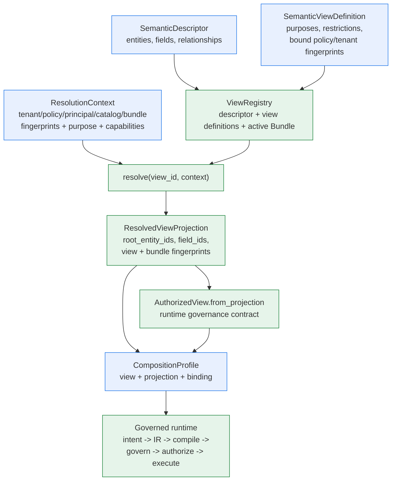

# Semantic Layer: Descriptors, Views, Projections, and Composition

> **Reader**: architects, security reviewers, and application integrators.
> **Prerequisites**: [Architecture overview](overview.md) and the
> [Metadata lifecycle](metadata-lifecycle.md).
>
> [简体中文](semantic-layer.zh-CN.md)

The semantic layer is the boundary between what a source *is* (physical
tables and columns) and what an application is *allowed to ask* (semantic
entities, fields, and relationships under governance). It exists so the
query path never depends on raw schema, never invents semantics, and can
fail closed on every trust dimension before any adapter executes.

## Artifacts and ownership

| Artifact | Owned by | Carries | Role |
| --- | --- | --- | --- |
| `SemanticDescriptor` | Metadata lifecycle (discovery + inference + review) or manual authoring | Entities, fields, relationships, `catalog_fingerprint` | The bounded semantic vocabulary of one source; field ids are unique across entities |
| `SemanticModelBundle` | Lifecycle publication | Validated descriptor + approved semantics, active snapshot identity | Immutable release unit; activation requires dependency and fingerprint checks |
| `SemanticViewDefinition` | Lifecycle or manual authoring | Allowed purposes, member restrictions, bound policy/tenant/principal fingerprints, capabilities, feature flags | The *contract*: which parts of the descriptor a caller may see under which trusted context |
| `ViewRegistry` + `ResolutionContext` | Host composition layer | Registry holds descriptors, definitions, and the active Bundle; context carries trusted fingerprints | Resolution: every security dimension is checked before any projection is returned |
| `ResolvedViewProjection` | `ViewRegistry.resolve(...)` | `root_entity_ids`, `field_ids`, resolved entities, allowed operations/relationships, view + Bundle fingerprints | The query-time handoff: the single source of truth for the authorized surface |
| `AuthorizedView` | `AuthorizedView.from_projection(projection)` or manual | `source_id`, `root_entity_ids`, `field_ids`, optional view binding | The runtime governance contract (IR validation, authorization, Memory revalidation) |
| `PhysicalBinding` | Host, from discovery bounds or source config | `object_id`, `dialect`, column bindings | Compiler context only — physical names never enter the semantic layer |
| `CompositionProfile` | Host application | The runtime parts, including `view` and `projection` | The public facade composition input |

Semantic artifacts carry *only* semantic references and safe descriptions —
never credentials, physical bindings, or hidden policy rules. Physical
names live exclusively in host-owned binding/configuration.

## Why the layer exists

- **Fail-closed governance**: resolution validates tenant scope, principal
  authorization, purpose, policy fingerprint, catalog fingerprint, Bundle
  fingerprint, model version, adapter capabilities, and feature flags —
  every dimension must match before a projection exists.
- **Drift and staleness**: the descriptor is bound to a catalog
  fingerprint; the Bundle to snapshot fingerprints. A changed schema,
  policy, tenant, or Bundle invalidates every previously recorded
  projection, checkpoint, and Memory reference.
- **Opaque evidence**: view and Bundle identities are `sha256` fingerprints
  in checkpoints, authorization records, and result lineage — never raw
  identifiers or payloads.
- **Physical isolation**: the semantic layer never leaks table names; the
  compiler receives them only through the host-owned binding.
- **AI safety**: the model provider sees bounded semantic context (fields,
  labels, allowed aggregations), and its intent is rejected if it names a
  source, entity, or field outside the authorized projection.

## The layer at a glance

**Reader question**: what exactly is "the semantic layer", who owns each
artifact, and where does the query path consume it?

**Text equivalent**: the descriptor and view definitions are semantic-only
inputs; the registry resolves a definition under a trusted context and
produces an authorized projection that carries every included root entity
and field together with view and Bundle fingerprints. The projection folds
into the `CompositionProfile` (as `view` and `projection`), and the
governed runtime consumes them for intent validation, IR compilation
evidence, governance, authorization, and result lineage.

## One query, one root

A view authorizes a **set** of root entities — `root_entity_ids` on the
projection, the authorized view, and the AI model context. Every query,
however, has exactly **one** `root_entity_id` (`SemanticQueryIR` and the
model intent both carry a single value). The set is the authorization
boundary; the single value is the request's choice inside it.

Enforcement is fail-closed at three points:

- **IR validation** rejects an IR whose `root_entity_id` is not in the
  authorized view's set (`entity_out_of_scope`).
- **AI intent resolution** rejects a model intent that names an entity
  outside the set (`UNSAFE_OUTPUT`).
- **Memory revalidation** treats a recalled reference whose root entity is
  no longer in the view as stale and asks for clarification.

Resolution builds the set from the view definition: every entity included
by the definition's restrictions (default: all descriptor entities, minus
exclusions) becomes a root and contributes its fields. A definition with
`include_entities={"order", "customer"}` therefore projects
`root_entity_ids={"order", "customer"}`.

### The physical boundary

The semantic layer is multi-root; the compiler is single-object. The SQL
compiler emits one `SELECT ... FROM <object>` statement from the single
`PhysicalBinding` of the profile — there is no join emission yet, and a
profile carries exactly one binding. Practical consequences:

- **Roots in one physical object** (denormalized table): one profile
  suffices — its view may authorize several roots and its binding covers
  all of their fields.
- **Roots in separate tables** (normalized, the common case): create **one
  profile per physical object**. Each profile gets its own adapter
  (allowlisted to that object), its own policy scope
  (`resource_ids` = the physical object name), its own view scoped to the
  roots/fields that map to that object, its own binding, and its own plan
  resolver. A shared descriptor and Bundle can back all of them.
- **Relationships** are governed vocabulary, not query mechanics — see
  [Relationships: governed vocabulary, compiled at query time](#relationships-governed-vocabulary-compiled-at-query-time).

See [CompositionProfile reference](../reference/composition-profile.md)
for the multi-root construction example.

### Relationships: governed vocabulary, compiled at query time

Relationships are governed **vocabulary** first: discovery derives them
from foreign keys (`orders_customers_via_customer_id`), view definitions
restrict `allowed_relationships`, and the metadata lifecycle tracks them
like every other member. The multi-entity join planner then compiles that
vocabulary into a deterministic `LogicalJoinPlan` at query time — the
vocabulary, the authorization surface, and the drift coverage are complete
*before* any join is emitted, so execution can never ship ungoverned. See
[Execution flow](execution-flow.md).

Three things depend on relationships today:

- **A complete semantic model** — a descriptor without relationships omits
  the most structured fact about a source (what links to what), which
  reviewers need to approve and which the discovery-to-Bundle lifecycle
  publishes.
- **An authorization dimension** — the registry rejects view definitions
  that allow relationships the descriptor does not define. At query time,
  the join planner checks every edge through
  `ResolvedViewProjection.contains_relationship` before a `LogicalJoinPlan`
  is produced; descriptor, view, and projection models needed no change.
- **Drift coverage** — removing or changing a relationship that a view
  definition references is **blocking** drift
  (`referenced_relationship_removed` / `referenced_relationship_changed`);
  unreferenced changes are warnings. A dropped foreign key stays visible
  to the lifecycle even when no query uses it — the same treatment fields
  receive.

In short, relationships make the layer *complete, governable, and
drift-visible*, and the multi-entity planner turns that governed vocabulary
into *executable* join plans.

## From projection to runtime

Order matters when building the profile from lifecycle output:

1. Build the **policy scope** and **tenant context** first — their
   fingerprints (`policy_fingerprint`, `scope_fingerprint`) are inputs to
   `ResolutionContext` and are bound by the view definition
   (`bound_policy_fingerprint`, `bound_tenant_scope_fingerprint`).
2. Resolve: `registry.resolve(view_id, resolution_context)` with the full
   trusted context (purpose, principal, catalog, Bundle, snapshot
   fingerprints, capabilities).
3. Fold the result into the profile: `view=AuthorizedView.from_projection(projection)`
   and `projection=projection`. When `projection` is bound, the runtime
   derives the authorized view and the semantic references itself and
   records structured Bundle evidence end to end.
4. Bind the host-owned parts: adapter, `binding` (physical names), plan
   resolver, provider, state store.

The step-by-step walkthrough lives in
[Metadata to active Bundle](../guides/metadata-to-bundle.md); the field
details are in the [CompositionProfile reference](../reference/composition-profile.md).

## Next steps

- [Metadata to active Bundle](../guides/metadata-to-bundle.md) — the
  lifecycle walkthrough and the projection-to-profile recipe.
- [CompositionProfile reference](../reference/composition-profile.md) —
  every profile field with construction examples.
- [Governance and tenancy](governance-and-tenancy.md) — who decides what.
- [Evidence and fingerprints](evidence-and-fingerprints.md) — how view and
  Bundle identities are computed and verified.
