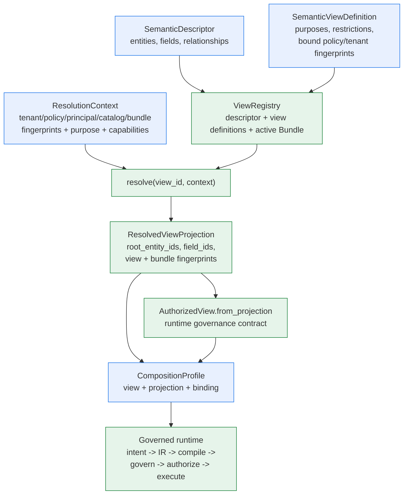

# 语义层：描述符、视图、投影与组合

> **读者**：架构师、安全评审人员和应用集成方。
> **前置阅读**：[架构总览](overview.zh-CN.md) 与
> [元数据生命周期](metadata-lifecycle.md)。
>
> [English source / 英文规范原文](semantic-layer.md)
>
> **本页为简体中文翻译**。规范语言为英文；如与[英文原文](semantic-layer.md)冲突，
> 以英文为准。

语义层是"数据源*是什么*"（物理表与列）与"应用*被允许问什么*"（受治理的语义实体、
字段与关系）之间的边界。它的存在使查询路径既不依赖原始 Schema，也永远不会自行
发明语义，并且能在任何适配器执行之前，对每个信任维度 fail closed。

## 构件与归属

| 构件 | 归属 | 携带内容 | 作用 |
| --- | --- | --- | --- |
| `SemanticDescriptor` | 元数据生命周期（发现 + 推断 + 评审）或手工编写 | 实体、字段、关系、`catalog_fingerprint` | 一个数据源的有界语义词汇表；字段 id 跨实体全局唯一 |
| `SemanticModelBundle` | 生命周期发布 | 校验通过的描述符 + 已批准的语义、活动快照身份 | 不可变发布单元；激活前必须通过依赖与 fingerprint 校验 |
| `SemanticViewDefinition` | 生命周期或手工编写 | 允许的目的、成员限制、绑定的 policy/tenant/principal fingerprint、能力、特性开关 | *契约*：在何种可信上下文下，调用方可看到描述符的哪一部分 |
| `ViewRegistry` + `ResolutionContext` | Host 组合层 | Registry 持有描述符、视图定义与活动 Bundle；context 携带可信 fingerprint | 解析：在返回任何投影之前，逐一校验每个安全维度 |
| `ResolvedViewProjection` | `ViewRegistry.resolve(...)` | `root_entity_ids`、`field_ids`、解析出的实体、允许的操作/关系、view + Bundle fingerprint | 查询期交接物：授权面的唯一事实来源 |
| `AuthorizedView` | `AuthorizedView.from_projection(projection)` 或手工构建 | `source_id`、`root_entity_ids`、`field_ids`、可选的视图绑定 | 运行时治理契约（IR 校验、授权、Memory 再校验） |
| `PhysicalBinding` | Host，来自 discovery 边界或数据源配置 | `object_id`、`dialect`、列绑定 | 仅作为编译器上下文——物理名称绝不进入语义层 |
| `CompositionProfile` | Host 应用 | 运行时各部分，包括 `view` 与 `projection` | 公共 facade 的组合输入 |

语义构件只携带语义引用与安全描述——绝不携带凭据、物理绑定或隐藏的 policy 规则。
物理名称只存在于 Host 拥有的绑定/配置中。

## 为什么需要这一层

- **Fail-closed 治理**：解析会校验租户范围、主体授权、目的、policy fingerprint、
  catalog fingerprint、Bundle fingerprint、模型版本、适配器能力与特性开关——
  任何维度都必须匹配，投影才会存在。
- **漂移与过期**：描述符绑定 catalog fingerprint，Bundle 绑定 snapshot
  fingerprint。Schema、policy、租户或 Bundle 一旦变化，此前记录的所有投影、
  checkpoint 与 Memory 引用全部失效。
- **不透明证据**：view 与 Bundle 身份在 checkpoint、授权记录和结果血缘中均为
  `sha256` fingerprint——绝不暴露原始标识或载荷。
- **物理隔离**：语义层绝不泄漏表名；编译器只通过 Host 持有的 binding 获得物理名。
- **AI 安全**：模型提供方只看到有界的语义上下文（字段、标签、允许的聚合），
  其 intent 若引用了授权投影之外的 source、实体或字段，将被拒绝。

## 语义层一览

**读者问题**："语义层"到底是什么，每个构件归谁所有，查询路径在哪里消费它？

**文字等价说明**：描述符与视图定义是纯语义输入；registry 在可信上下文下解析视图
定义，产出携带全部被包含根实体、字段以及 view/Bundle fingerprint 的授权投影。
投影以 `view` 与 `projection` 的形式折叠进 `CompositionProfile`，受治理的运行时
在 intent 校验、IR 编译证据、治理、授权与结果血缘中消费它们。

## 一次查询，一个根

视图授权的是一个根实体**集合**——投影、授权视图与 AI 模型上下文上的
`root_entity_ids`。但每条查询恰好只有**一个** `root_entity_id`
（`SemanticQueryIR` 与模型 intent 都只携带单值）。集合是授权边界；
单值是该请求在集合内的选择。

三处 fail-closed 强制点：

- **IR 校验**拒绝 `root_entity_id` 不在授权视图集合内的 IR（`entity_out_of_scope`）。
- **AI intent 解析**拒绝引用集合外实体的模型 intent（`UNSAFE_OUTPUT`）。
- **Memory 再校验**将根实体已不在视图中的召回引用视为过期，并请求澄清。

解析按视图定义构建集合：定义的限制条件包含的每个实体（默认是描述符全部实体减去
排除项）都成为根并贡献字段。因此 `include_entities={"order", "customer"}` 的定义
会投影出 `root_entity_ids={"order", "customer"}`。

### 物理边界

语义层支持多根；编译器是单对象。SQL 编译器从 profile 的单个 `PhysicalBinding`
生成一条 `SELECT ... FROM <object>` 语句——目前还没有 join 输出，且一个 profile
只携带一个 binding。实际影响：

- **根位于同一物理对象**（反规范化表）：一个 profile 即可——视图可以授权多个根，
  binding 覆盖它们全部字段。
- **根位于不同表**（规范化，常见情况）：**每个物理对象一个 profile**。每个
  profile 拥有自己的适配器（allowlist 限定到该对象）、自己的 policy scope
  （`resource_ids` = 物理对象名）、限定到该对象根/字段的视图、自己的 binding
  与自己的 plan resolver。所有这些可以共享同一个描述符与 Bundle。
- **关系**是被治理的词汇，不是查询机制——见
  [关系：词汇先行，执行在后](#关系词汇先行执行在后)。

多根构建示例见 [CompositionProfile 参考](../reference/composition-profile.zh-CN.md)。

### 关系：词汇先行，执行在后

关系是被治理的**词汇**，不是查询机制：discovery 从外键派生它们
（`orders_customers_via_customer_id`），视图定义通过 `allowed_relationships`
限制它们，元数据生命周期像对待其他成员一样跟踪它们——但没有任何东西把它们
编译成 join，IR 也没有关系成员。这个缺口是刻意的：词汇、授权面与漂移覆盖在
执行能力**之前**就完整就位，未来的 join 发射器因此永远不会在没有治理的情况下
上线。

今天有三件事依赖关系：

- **完整的语义模型**——没有关系的描述符遗漏了关于数据源最有结构的事实（什么
  关联什么），而评审人需要它来批准、discovery 到 Bundle 的生命周期需要发布它。
- **一个授权维度**——注册器拒绝视图定义允许描述符中不存在的关系。join 发射
  能力到来时，`ResolvedViewProjection.contains_relationship` 就是现成的运行时
  校验点；描述符、视图与投影模型都不需要改动。
- **漂移覆盖**——删除或变更视图定义引用的关系是**阻断性**漂移
  （`referenced_relationship_removed` / `referenced_relationship_changed`）；
  未被引用的变更只是警告。被删除的外键即使没有任何查询使用，也会被生命周期
  看见——与字段受到的待遇相同。

简言之，关系让这一层在今天**完整、可治理、漂移可见**，在未来**可执行**。

## 从投影到运行时

使用生命周期输出构建 profile 时，顺序很重要：

1. 先构建 **policy scope** 与 **tenant context**——它们的 fingerprint
   （`policy_fingerprint`、`scope_fingerprint`）是 `ResolutionContext` 的输入，
   并被视图定义绑定（`bound_policy_fingerprint`、
   `bound_tenant_scope_fingerprint`）。
2. 解析：用完整可信上下文（purpose、principal、catalog、Bundle、snapshot
   fingerprint、能力）调用 `registry.resolve(view_id, resolution_context)`。
3. 把结果折叠进 profile：`view=AuthorizedView.from_projection(projection)` 与
   `projection=projection`。绑定 `projection` 后，运行时自行推导授权视图与语义引用，
   并在全链路记录结构化的 Bundle 证据。
4. 绑定 Host 拥有的部分：adapter、`binding`（物理名）、plan resolver、provider、
   state store。

逐步演练见[从元数据到激活 Bundle](../guides/metadata-to-bundle.zh-CN.md)；
字段细节见 [CompositionProfile 参考](../reference/composition-profile.zh-CN.md)。

## 下一步

- [从元数据到激活 Bundle](../guides/metadata-to-bundle.zh-CN.md) — 生命周期演练
  与投影到 profile 的配方。
- [CompositionProfile 参考](../reference/composition-profile.zh-CN.md) — 每个
  profile 字段及构建示例。
- [治理与租户隔离](governance-and-tenancy.md) — 谁做决策。
- [证据与指纹](evidence-and-fingerprints.zh-CN.md) — view 与 Bundle 身份如何
  计算与校验。
