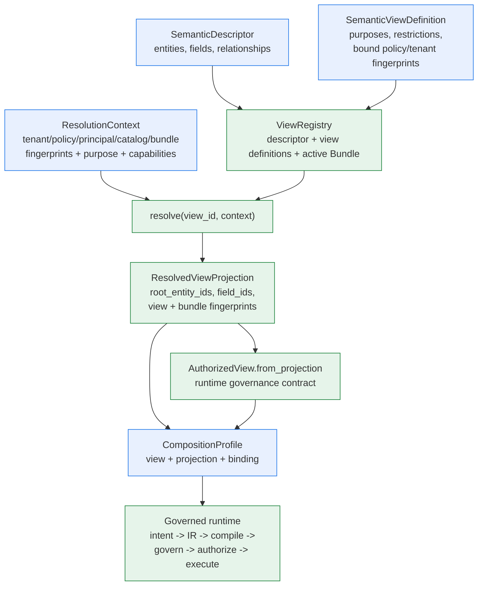

# 语义层：描述符、视图、投影与组合

> **读者**：架构师、安全评审人员和应用集成方。
> **前置阅读**：[架构总览](overview.zh-CN.md) 与
> [元数据生命周期](metadata-lifecycle.md)。
>
> [English source / 英文规范原文](semantic-layer.md)
>
> **本页为简体中文翻译**。规范语言为英文；如与[英文原文](semantic-layer.md)冲突，
> 以英文为准。

语义层是"数据源*是什么*"（物理表与列）与"应用*被允许问什么*"（受治理的语义实体、
字段与关系）之间的边界。它的存在使查询路径既不依赖原始 Schema，也永远不会自行
发明语义，并且能在任何适配器执行之前，对每个信任维度 fail closed。

## 构件与归属

| 构件 | 归属 | 携带内容 | 作用 |
| --- | --- | --- | --- |
| `SemanticDescriptor` | 元数据生命周期（发现 + 推断 + 评审）或手工编写 | 实体、字段、关系、`catalog_fingerprint` | 一个数据源的有界语义词汇表；字段 id 跨实体全局唯一 |
| `AssemblyDraft` | 控制面生命周期 | 确定性 assertions、provenance、review bindings、deployment references、`draft_revision` | 处于 `draft`、`review` 或 `approved` 的可编辑发布前工作区；绝不携带 Bundle fingerprint |
| `SemanticModelBundle` | 生命周期发布 | 校验通过的描述符 + 已批准语义载荷、活动快照身份 | 不可变 publish 输出；在 publish 时取得语义 fingerprint，并按 fingerprint 激活 |
| `SemanticViewDefinition` | 生命周期或手工编写 | 允许的目的、成员限制、绑定的 policy/tenant/principal fingerprint、能力、特性开关 | *契约*：在何种可信上下文下，调用方可看到描述符的哪一部分 |
| `ViewRegistry` + `ResolutionContext` | Host 组合层 | Registry 持有描述符、视图定义与活动 Bundle；context 携带可信 fingerprint | 解析：在返回任何投影之前，逐一校验每个安全维度 |
| `ResolvedViewProjection` | `ViewRegistry.resolve(...)` | `root_entity_ids`、`field_ids`、解析出的实体、允许的操作/关系、view + Bundle fingerprint | 查询期交接物：授权面的唯一事实来源 |
| `AuthorizedView` | `AuthorizedView.from_projection(projection)` 或手工构建 | `source_id`、`root_entity_ids`、`field_ids`、可选的视图绑定 | 运行时治理契约（IR 校验、授权、Memory 再校验） |
| `PhysicalBinding` | Host，来自 discovery 边界或数据源配置 | `object_id`、`dialect`、列绑定 | 仅作为编译器上下文——物理名称绝不进入语义层 |
| `CompositionProfile` | Host 应用 | 运行时各部分，包括 `view` 与 `projection` | 公共 facade 的组合输入 |

语义构件只携带语义引用与安全描述——绝不携带凭据、物理绑定或隐藏的 policy 规则。
物理名称只存在于 Host 拥有的绑定/配置中。

Assertion review 属于控制面元数据。Approved/rejected 决策绑定 canonical assertion
payload hash，因此语义内容变化会让 assertion 回到 `pending`；rejected assertion 只作为
负面证据，绝不进入运行时权威。Publish 派生用于 rediscovery 对齐的不可变
accepted-assertion manifest，以及记录 approval、verification、provenance、idempotency
与已打码 deployment binding 的 audit record。两者都不进入 Bundle fingerprint domain。

## 为什么需要这一层

- **Fail-closed 治理**：解析会校验租户范围、主体授权、目的、policy fingerprint、
  catalog fingerprint、Bundle fingerprint、模型版本、适配器能力与特性开关——
  任何维度都必须匹配，投影才会存在。
- **漂移与过期**：描述符绑定 catalog fingerprint，Bundle 绑定 snapshot
  fingerprint。Schema、policy、租户或 Bundle 一旦变化，此前记录的所有投影、
  checkpoint 与 Memory 引用全部失效。
- **不透明证据**：view 与 Bundle 身份在 checkpoint、授权记录和结果血缘中均为
  `sha256` fingerprint——绝不暴露原始标识或载荷。
- **语义身份**：Bundle fingerprint 只覆盖 canonical semantic payload；provenance、
  reviewer identity、review state、deployment binding、audit、activation、supersession
  与文件表现形式都被排除。
- **物理隔离**：语义层绝不泄漏表名；编译器只通过 Host 持有的 binding 获得物理名。
- **AI 安全**：模型提供方只看到有界的语义上下文（字段、标签、允许的聚合），
  其 intent 若引用了授权投影之外的 source、实体或字段，将被拒绝。

## 语义层一览

**读者问题**："语义层"到底是什么，每个构件归谁所有，查询路径在哪里消费它？

**文字等价说明**：描述符与视图定义是纯语义输入；registry 在可信上下文下解析视图
定义，产出携带全部被包含根实体、字段以及 view/Bundle fingerprint 的授权投影。
投影以 `view` 与 `projection` 的形式折叠进 `CompositionProfile`，受治理的运行时
在 intent 校验、IR 编译证据、治理、授权与结果血缘中消费它们。

## 一次查询，一个根

视图授权的是一个根实体**集合**——投影、授权视图与 AI 模型上下文上的
`root_entity_ids`。但每条查询恰好只有**一个** `root_entity_id`
（`SemanticQueryIR` 与模型 intent 都只携带单值）。集合是授权边界；
单值是该请求在集合内的选择。

三处 fail-closed 强制点：

- **IR 校验**拒绝 `root_entity_id` 不在授权视图集合内的 IR（`entity_out_of_scope`）。
- **AI intent 解析**拒绝引用集合外实体的模型 intent（`UNSAFE_OUTPUT`）。
- **Memory 再校验**将根实体已不在视图中的召回引用视为过期，并请求澄清。

解析按视图定义构建集合：定义的限制条件包含的每个实体（默认是描述符全部实体减去
排除项）都成为根并贡献字段。因此 `include_entities={"order", "customer"}` 的定义
会投影出 `root_entity_ids={"order", "customer"}`。

### 物理边界

语义层支持多根；编译器是单对象。SQL 编译器从 profile 的单个 `PhysicalBinding`
生成一条 `SELECT ... FROM <object>` 语句——目前还没有 join 输出，且一个 profile
只携带一个 binding。实际影响：

- **根位于同一物理对象**（反规范化表）：一个 profile 即可——视图可以授权多个根，
  binding 覆盖它们全部字段。
- **根位于不同表**（规范化，常见情况）：**每个物理对象一个 profile**。每个
  profile 拥有自己的适配器（allowlist 限定到该对象）、自己的 policy scope
  （`resource_ids` = 物理对象名）、限定到该对象根/字段的视图、自己的 binding
  与自己的 plan resolver。所有这些可以共享同一个描述符与 Bundle。
- **关系**是被治理的词汇，不是查询机制——见
  [关系：受治理的词汇，查询期编译](#关系受治理的词汇查询期编译)。

多根构建示例见 [CompositionProfile 参考](../reference/composition-profile.zh-CN.md)。

### 关系：受治理的词汇，查询期编译

关系首先是受治理的**词汇**：discovery 从外键派生它们
（`orders_customers_via_customer_id`），视图定义通过 `allowed_relationships`
限制它们，元数据生命周期像对待其他成员一样跟踪它们。多实体连接规划器随后在
查询期把这些词汇编译为确定性的 `LogicalJoinPlan`——词汇、授权面与漂移覆盖在
任何 join 发射**之前**就已完整就位，执行因此永远不会在没有治理的情况下上线。
参见[执行流程](execution-flow.zh-CN.md)。

今天有三件事依赖关系：

- **完整的语义模型**——没有关系的描述符遗漏了关于数据源最有结构的事实（什么
  关联什么），而评审人需要它来批准、discovery 到 Bundle 的生命周期需要发布它。
- **一个授权维度**——注册器拒绝视图定义允许描述符中不存在的关系。查询期，
  连接规划器在产生 `LogicalJoinPlan` 之前，通过
  `ResolvedViewProjection.contains_relationship` 逐一校验每条边；描述符、
  视图与投影模型都不需要改动。
- **漂移覆盖**——删除或变更视图定义引用的关系是**阻断性**漂移
  （`referenced_relationship_removed` / `referenced_relationship_changed`）；
  未被引用的变更只是警告。被删除的外键即使没有任何查询使用，也会被生命周期
  看见——与字段受到的待遇相同。

简言之，关系让这一层完整、可治理、漂移可见，而多实体规划器把这些受治理的
词汇转化为**可执行**的连接计划。

## 从投影到运行时

使用生命周期输出构建 profile 时，顺序很重要：

1. 先构建 **policy scope** 与 **tenant context**——它们的 fingerprint
   （`policy_fingerprint`、`scope_fingerprint`）是 `ResolutionContext` 的输入，
   并被视图定义绑定（`bound_policy_fingerprint`、
   `bound_tenant_scope_fingerprint`）。
2. 解析：用完整可信上下文（purpose、principal、catalog、Bundle、snapshot
   fingerprint、能力）调用 `registry.resolve(view_id, resolution_context)`。
3. 把结果折叠进 profile：`view=AuthorizedView.from_projection(projection)` 与
   `projection=projection`。绑定 `projection` 后，运行时自行推导授权视图与语义引用，
   并在全链路记录结构化的 Bundle 证据。
4. 绑定 Host 拥有的部分：adapter、`binding`（物理名）、plan resolver、provider、
   state store。

逐步演练见[从元数据到激活 Bundle](../guides/metadata-to-bundle.zh-CN.md)；
字段细节见 [CompositionProfile 参考](../reference/composition-profile.zh-CN.md)。

## 值级语义（v4.1）

枚举编码字段可以在其 `SemanticFieldDescriptor` 上声明 `ValueSemantics`
块：从业务词（键）到存储值的有界 `value_mapping`，可选的
`display_order` 与 `sample_values`，`pii` 标志，以及
`unknown_value_policy`（`reject` | `warn`）。

**映射做什么——不做什么。** 不变式 N4 重述为：*不允许概率性构造；
允许确定性的受治理查找。* 模型仍然绝不会被要求发明或猜测值；意图
解析器在 **IR 冻结之前** 对过滤值执行针对已声明映射的确定性查找，
且映射只从 bundle 引用的描述符快照（按 catalog fingerprint）读取。
快照不可用或指纹不匹配时解析 fail closed
（`VALUE_SNAPSHOT_UNAVAILABLE`）——过期的注册表绝不可能泄漏进来。
在 `reject` 策略下，既不是已知业务词也不是存储值的过滤值会失败关闭
（`VALUE_UNKNOWN`，`VS_001`）；`warn` 策略下则带着 warned 结果继续。
被映射字段只接受 `eq`/`in` 操作符（其余被 `VS_002` 拒绝）；存储值在
类型严格成员判定下受控通过；混合 `in` 列表逐值解析并在冻结前去重。

**VS_001 所有权变更。** 未知过滤值不再是延迟到编译阶段的失败：
`VS_001` 在 **解析阶段**、IR 尚不存在时抛出，并携带有界、证据安全的
细节集（字段、尝试值、已知业务词——绝不包含物理名或映射内容）。

**结果通道。** 每个过滤值在解析结果通道上产生一个有界状态
（`hit` / `pass_through` / `warned` / `miss` / `unpolicied`），同时携带
描述符快照指纹。该通道由编排层与评估层消费——绝不进入编译证据，
编译证据保持仅指纹。评估将状态聚合成按用例、按运行的 `VS_HIT` /
`VS_PASS_THROUGH` / `VS_WARNED` / `VS_MISS` / `VS_UNPOLICIED` 归因
（延迟的 `pii` 行为见
[ADR：pii 掩码执行点](adr-pii-masking-enforcement-point.zh-CN.md)；
该标志本身只是 schema + 指纹属性）。

**延迟行为（v2 展望）。** `pii` 掩码在 v4.1 没有运行时实现：该标志只是
schema + 指纹属性，延迟到
[pii ADR](adr-pii-masking-enforcement-point.zh-CN.md) 之后的变更。同样，
`display_order` 仅在 schema 中保留而无行为——v4.1 绝不会从它派生排序
（例如 `ORDER BY` 生成）。它未来是通过专用 IR 指令驱动排序，还是保持
纯展示用途，属于 v2 关注点，v1 不做任何承诺。

### 映射升级清单

任何 `ValueSemantics` 内容修改——映射条目、样本值、未知值策略或
展示顺序——都是 **快照破坏事件**，必须遵循完整清单：

1. 在描述符中修改映射：描述符 fingerprint 随之改变。
2. catalog snapshot fingerprint 一并改变。
3. 引用旧快照的 Bundle **校验失败** `catalog_incompatible`——这是
   预期的 fail-closed 行为，不是事故。
4. 针对新快照重新发布 Bundle。
5. 重新审计旧 Bundle 下签发的证据：既有授权、checkpoint 与结果均已
   过期，需要重新校验。

**对既有字段的首次采纳。** 在一个此前没有值语义的字段上首次声明
`ValueSemantics` 是该字段的行为开关：`eq`/`in` 白名单（`VS_002`）
对新解析立即生效，因此该字段上此前使用其他操作符（`ne`、比较类）
且可正常工作的过滤，会开始在解析阶段失败。采纳之前，先评估既有
查询对该字段的操作符分布。

### 切片门禁（路线图）

v4.1 质量门禁——**`VS_HIT` ≥ 90%**，覆盖带标注的 demo/评估语料，
从完整语料运行的归因摘要
（`EvaluationReport.value_semantics_summary()`）读取——是 v4.2 切片
（计算字段）启动所依据的前提条件。门禁记录在本路线图说明中，
不在代码里——归因维度就是被测量的输入。v4.2 门禁记录在下方
[计算字段切片门禁](#计算字段切片门禁路线图)。

## 计算字段（v4.2）

实体描述符可以声明一个有界的 `CalculatedField` 列表（数量 ≤ 32）：
对实体自身数值字段的受治理、已指纹化的表达式，由编译器在编译期
确定性展开。表达式语言是封闭白名单（`field`、`const`、`add`、
`sub`、`mul`、`div`）；每个被拒绝的构造及其替代路径记录在
[ADR-045](adr-calculated-field-operator-whitelist.zh-CN.md)。

**编译器做什么。** 表达式永远不进入 IR —— 选择项**按名称**引用
计算字段（未知名称由 `CF_003` fail-closed 拒绝），引用它的 IR 会
携带 `calculated-fields` 能力；编译器重新校验表达式树，通过物理
绑定解析 `field` 叶子，并发出带显式 CAST 的适配器原生输出以强制
声明的输出类型（`div` 为真除法；一致性套件固定 `7 / 2 → 3.5` 以
捕获 SQLite 整数除法截断）。运行期没有任何解释。`zero_division_policy`
（`null` | `error`）按字段声明：`null` 通过守卫展开产生 NULL/缺失，
`error` 抛出结构化的 `CF_005` 执行失败。

**治理链。** 计算字段是实体级可选成员，因此不变式 **N6 原样适用**
（见下方清单）：声明它就是快照破坏事件，且**对计算字段内容的任何
修改——表达式、策略、label、输出类型——都是快照破坏事件**，必须
遵循与值语义相同的升级清单（descriptor fingerprint → snapshot
fingerprint → 旧 Bundle 的 `catalog_incompatible` → 重新发布 →
重新审计证据）。对 `pii: true` 字段的引用在**两个方向**上都被
`CF_004` 拒绝：在计算字段定义期，以及在 Bundle 校验期（后续对
已被计算字段引用的字段应用 pii）。未来字段掩码策略模型落地时，
其目标字段必须接入同一交集检查。理由（掩码由适配器对
输出列的后处理强制；派生列会绕过该执行点）见
[pii 掩码 ADR](adr-pii-masking-enforcement-point.zh-CN.md) 与
ADR-045。

**提示上下文。** 计算字段身份（`name`、`label`、`description`、
`output_type`——绝不是表达式或策略）作为有界、安全内容校验过的
上下文进入模型指令包。模型仍然只按名称引用：模型发出的表达式
材料会被结构化拒绝（N4）。

### 计算字段归因

评估层把计算字段结果聚合为有界的 `CF_HIT` / `CF_COMPILE_FAIL` /
`CF_NOT_DECLARED` / `CF_NOT_REFERENCED` 归因——按选择项记录在
`CaseEvidence` 上，按用例、按运行通过
`EvaluationReport.calculated_field_summary()` 汇总。
`demo/questions/questions.yml` 中的语料标注遵循与值语义标注相同的
仅元数据模式：偏差被记录，绝不会导致崩溃。

### 计算字段切片门禁（路线图）

v4.2 质量门禁从完整带标注语料运行的 `calculated_field_summary()`
读取：组合 **`CF_NOT_DECLARED + CF_NOT_REFERENCED < 10%`** 与 DSL
表达式失败率（**`CF_COMPILE_FAIL` < 5%**）。与 v4.1 门禁一样，
门禁记录在本路线图说明中，不在代码里。

### 首次采纳指引

在声明计算字段之前，先评估适配器的 `calculated-fields` 能力支持：
未声明该能力的适配器上，引用查询会 fail-closed。第一个声明计算
字段的 Bundle 会改变快照 fingerprint，需要重新发布与证据重新审计
（与 v4.1 清单逐字相同），因此建议配合计划内的重新发布窗口声明。

### NamedQuery 占位符保留（v4.4）

IR 携带一个保留的、零行为扩展 schema（`named_query_placeholder`，
能力 `named-query-placeholders`）：类型化标量参数负载（`name`、
`scalar_type` 取值 `str|int|float|bool`、`required`），不含物理名称。
在 v4.2 中该保留是 **fail-closed** 的：没有任何适配器声明该能力，
携带占位符的查询无法执行，无效的占位符负载会导致 IR 构造失败。
占位符在计算字段表达式树内结构上不可表达；v4.4 扩展白名单时不得
开放这条路径。运行期参数值需要 v4.1 的 bool/int 子类纪律（const
值是指纹域标量，不是伪装成 int 的 Python bool）。v4.4 可以在自己的
变更中修订该保留——按 N6 对称性，移除是指纹安全的。

## 可选成员评审清单（N6）

未来每一个*可选*描述符成员（v4.1 的 `ValueSemantics`、v4.2 的
`CalculatedField`、v4.3 的 `Metric`）都继承不变式 **N6**：未设置的成员必须完全从
`canonical_payload()` 中省略，而不是序列化为 `null`，这样引入该成员后，
所有 descriptor、snapshot 与 bundle 的 fingerprint 保持逐字节一致。
合并新的可选成员前请确认：

- `canonical_payload()` 仅在成员已设置时包含对应键。
- 模型校验器拒绝"提供了但为空"的容器（"set means non-empty"），
  并拒绝会威胁 fingerprint 稳定性的值（`bool`、`float`、超长词项）。
- 有单元测试固定不变式三元组——在显式 `None` 成员存在与否两种情况下，
  descriptor payload、snapshot fingerprint、bundle fingerprint 完全一致——
  并有快照破坏测试证明修改成员内容会改变 snapshot fingerprint，
  且对基于旧快照构建的 Bundle 校验失败（`catalog_incompatible`）。
  `tests/unit/test_value_semantics.py` 是参考模式
  （`TestN6OmitWhenUnset`、`TestSnapshotBreakingChain`）。

## 下一步

- [从元数据到激活 Bundle](../guides/metadata-to-bundle.zh-CN.md) — 生命周期演练
  与投影到 profile 的配方。
- [CompositionProfile 参考](../reference/composition-profile.zh-CN.md) — 每个
  profile 字段及构建示例。
- [治理与租户隔离](governance-and-tenancy.md) — 谁做决策。
- [证据与指纹](evidence-and-fingerprints.zh-CN.md) — view 与 Bundle 身份如何
  计算与校验。
