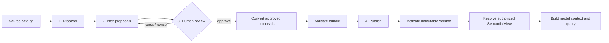

# From Source Metadata to an Active Semantic Bundle

> **Reader**: application owners, data stewards, and platform operators.
> **Prerequisites**: [Installation](../getting-started/installation.md) and the
> [architecture overview](../architecture/overview.md).
>
> **Language**: English is normative. See the
> [Chinese translation](metadata-to-bundle.zh-CN.md).

This guide answers four practical questions:

- Which steps run once, and which run again after a source or business change?
- Where does a person make a decision?
- Where are snapshots and bundles stored in the current implementation?
- How does a query use the activated result?

## The lifecycle



The first four stages are a **control-plane workflow**. They produce a
versioned semantic asset that can serve many queries. They are not normally
repeated for every user prompt.

## Does this need a UI or an API?

The core library does not provide an admin UI, HTTP server, or REST API. It is
an embeddable Python runtime, so the host application owns the control-plane
entry point. A small internal CLI or Python job is sufficient for a single
team; a service API is appropriate for automation; and a steward-facing UI is
useful when non-developers must review business meaning.

The recommended production shape is a host-owned control plane over the core
contracts:

| Control-plane action | Suitable interface | Core operation |
| --- | --- | --- |
| Start bounded discovery | CLI, scheduled job, or service API | discover and `SnapshotLedger.register` |
| Inspect proposals | UI or review API | read `SemanticProposalSet` |
| Approve/reject/revise | UI or protected review API | proposal-set review methods |
| Build and validate Bundle | service job or release pipeline | `convert_approved_proposals` and Bundle validation |
| Publish/activate/rollback | protected admin API or release pipeline | `catalog.publish`, `.activate`, `.rollback` |
| Resolve for querying | application runtime | `ViewRegistry.resolve` |

The review and activation endpoints must authenticate the operator, enforce
tenant/source scope, record approval and release evidence, and never accept a
client-supplied authorization claim as trusted context. The UI is therefore a
human-friendly projection of the control plane, not a replacement for the
core validation and fail-closed gates.

## 1. Discovery: obtain technical facts

A host selects a source, allowlist, tenant scope, and bounded discovery
configuration. `SqlMetadataDiscoverer` or `MongoMetadataDiscoverer` reads
structural metadata using a read-only identity and returns an immutable
`MetadataSnapshot`.

The snapshot can contain table/collection names, fields or paths, normalized
types, relationships, bounded protected statistics, freshness, completeness,
provenance, and a canonical fingerprint. It must not contain credentials,
connection strings, native clients, raw rows/documents, or unrestricted sample
values.

**Human work:** choose the source and allowlist, define discovery bounds, and
provide trusted tenant/source authorization. The host may schedule discovery
again when the schema changes or the snapshot becomes stale.

**Stored where:** the current reference lifecycle component is the host-owned,
process-local `SnapshotLedger`. `register(snapshot, ...)` retains a snapshot as
inactive evidence; `active(source_id, tenant_scope_fingerprint)` reads the
active snapshot. It is not an automatic PostgreSQL persistence layer.

## 2. Semantic inference: propose business meaning

`infer_proposals(snapshot, ...)` derives bounded proposals such as:

- business entities and fields
- relationships and grain
- measures and aggregation behavior
- aliases/synonyms and classifications

Each proposal carries its source snapshot fingerprint, trust (`declared`,
`observed`, or `inferred`), evidence, method, confidence where applicable, and
freshness. Inference is assistance, not authority.

**Human work:** normally no person is required to create the initial
proposals, but a data steward should inspect them before approval. A proposal
can be rejected or revised when a technical name has the wrong business
meaning.

## 3. Review and approval: the main human checkpoint

This is the stage that requires explicit human or equivalent governed
approval. A reviewer examines each proposal against the source and business
semantics, then chooses:

- `approve`: proposal is eligible for Bundle input
- `reject`: proposal is excluded
- `revise`: the old proposal is superseded and a new `PENDING` proposal must be
  approved separately

`SemanticProposalSet.approve(...)`, `.reject(...)`, and `.revise(...)` return
new immutable sets. Unknown proposal IDs are errors; review cannot silently
skip a requested item. An inferred or merely observed proposal cannot grant
View visibility, tenant access, mandatory filters, or execution authorization.

For a production workflow, record who/what approved the set, when, and which
snapshot fingerprint was reviewed. The core proposal model preserves safe
provenance references; the surrounding host owns the human identity and
approval workflow.

## 4. Convert, publish, and activate: programmatic gates

`convert_approved_proposals(...)` converts only `APPROVED` proposals into a
Bundle input. If no proposal is approved, it returns no input. The source
snapshot fingerprint and proposal references remain attached so stale review
cannot be mistaken for current metadata.

The host then constructs and validates a `SemanticModelBundle`. Validation
checks structure, cross-references, versions, source compatibility, trust and
proposal references, bounds, and unsafe content. A valid Bundle is published
with `SemanticBundleCatalog.publish(...)`; publication stores an immutable
version and does not make it active. Duplicate versions are rejected.

Activation is an explicit pointer change:

```python
catalog.publish(bundle, production=production_context)
catalog.activate(bundle.bundle_id, bundle.model_version,
                 production=production_context)
active = catalog.active(bundle.bundle_id)
```

When production context is supplied, publication/activation also checks the
active discovery snapshot, tenant/source scope, freshness, completeness, and
drift policy. Dependencies must be published with matching fingerprints.
Activation is atomic: a rejected candidate leaves the existing active Bundle
unchanged. Rollback points the active pointer at a previous valid immutable
version; it does not mutate the old artifact.

**Human work:** approve the change and authorize the release according to the
host's change-management policy. The structural and compatibility checks are
performed by the runtime and catalog; a human does not manually bypass them.

**Stored where:** the repository provides `InMemorySemanticBundleCatalog` as a
bounded process-local reference catalog. It keeps immutable publications, an
active pointer, and activation history in memory. A durable/shared Bundle
catalog is host-owned and is not silently provided by the current core. Do not
confuse it with `nl2data-workflow-postgres`'s `PostgreSQLStateStore`, which
stores safe workflow state and idempotency records.

## How a query references the result

A query does not pass the raw snapshot or proposal set directly to the model.
The host binds the active Bundle to a `ViewRegistry`. The View is resolved with
trusted context containing the tenant scope and, for bundle-backed resolution,
the current Bundle fingerprint and compatible snapshot fingerprint.

```python
registry = ViewRegistry(
    descriptors=(descriptor,),
    views=(view_definition,),
    bundle=catalog.active("sales-semantic-model"),
)
resolved = registry.resolve("sales", trusted_resolution_context)
```

The resolved View is the authorized projection. The core uses it to assemble a
`ModelInstructionBundle`; the optional model provider sees bounded semantic
context, not database clients or raw catalogs. The resulting structured intent
is converted to `SemanticQueryIR`, then validated, compiled, governed,
authorized, and executed.

A Bundle or snapshot fingerprint mismatch causes resolution or activation to
fail closed. This prevents a query from using an old semantic definition after
schema, policy, tenant, or Bundle context has changed.

## From the resolved View to a CompositionProfile

The resolved projection is the lifecycle's query-time handoff to the
application runtime. The host folds it into the public `CompositionProfile`
used by the `NL2Data` facade:

| Profile part | Source | Notes |
| --- | --- | --- |
| `view` | `AuthorizedView.from_projection(projection)` | Carries `source_id`, `root_entity_ids`, `field_ids`, and the bound `view_id`/`view_version`/`view_fingerprint` (the projection fingerprint) |
| `projection` | The resolved `ResolvedViewProjection` | Binds Bundle identity and fingerprint into compilation, authorization, and result-lineage evidence; the runtime derives the authorized view and semantic references from it |
| `adapter` | Host, mirroring the discovery bounds | `allowed_objects`/`allowed_columns` should match the snapshot allowlist |
| `policy_scope` | Host-owned governance | Must exist before resolution: its `policy_fingerprint` is the view's `bound_policy_fingerprint`; `resource_ids` use physical object names |
| `binding` | Host-owned, from the discovery snapshot or source config | The Bundle descriptor is semantic-only; physical names never enter it |
| `tenant_context` | Host-owned trusted scope | Its `scope_fingerprint` gates resolution (`bound_tenant_scope_fingerprint`) |

Order matters: the tenant scope and policy scope must exist **before** view
resolution, because their fingerprints are inputs to `ResolutionContext`.
The physical binding and the adapter are independent of the Bundle.

```python
from nl2data import CompositionProfile, NL2Data
from nl2data_core.planning.validation import AuthorizedView

# policy + tenant first: their fingerprints feed view resolution
projection = registry.resolve("sales_view", trusted_resolution_context).projection

profile = CompositionProfile(
    provider=model_provider,
    adapter=query_adapter,
    policy_scope=policy_scope,                      # resource_ids = physical objects
    view=AuthorizedView.from_projection(projection),
    projection=projection,                          # bundle evidence end to end
    binding=physical_binding,                       # physical names, host-owned
    plan_resolver=plan_resolver,
    state_store=state_store,
    tenant_context=scope,
)

facade = NL2Data(composition=profile)
```

When `projection` is bound, the runtime builds the authorized view and the
semantic references from the projection automatically, and every evidence
record (checkpoints, authorization, result lineage) carries the resolved-view
fingerprint and the Bundle identity. Without it, the host must build `view`
and `semantic_references` itself, and Bundle identity commits only
transitively through the view fingerprint.

## What changes trigger the lifecycle again?

| Change | Repeat from | Typical action |
| --- | --- | --- |
| New table/field or changed type | Discovery | Register a new snapshot and compare drift |
| New business definition or alias | Inference/review | Revise or add proposals, then approve |
| Approved semantic model release | Convert/publish | Publish a new immutable Bundle version |
| Deployment release | Activate | Move the active pointer after checks |
| Different tenant or purpose | View resolution | Resolve a different authorized View |
| New natural-language request | Query intent | Build context and identify this request's intent |

Discovery and Bundle persistence are deliberately host-owned extension points.
For a durable multi-process deployment, provide a shared implementation with
the same fingerprint, authorization, atomic activation, and fail-closed
semantics rather than treating process memory as a production database.

## Related pages

- [Metadata lifecycle](../architecture/metadata-lifecycle.md) — contract and drift policy
- [Semantic layer](../architecture/semantic-layer.md) — descriptors, views, projections, multi-root sources
- [CompositionProfile reference](../reference/composition-profile.md) — every profile field with examples
- [Evidence and fingerprints](../architecture/evidence-and-fingerprints.md) — safe identity references
- [Services](../operations/services.md) — source connection profiles
