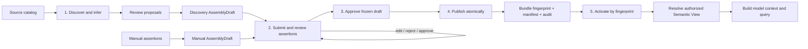

# From Source Metadata to an Active Semantic Bundle

> **Reader**: application owners, data stewards, and platform operators.
> **Prerequisites**: [Installation](../getting-started/installation.md) and the
> [architecture overview](../architecture/overview.md).
>
> **Language**: English is normative. See the
> [Chinese translation](metadata-to-bundle.zh-CN.md).

This guide answers four practical questions:

- Which steps run once, and which run again after a source or business change?
- Where does a person make a decision?
- Where are snapshots and bundles stored in the current implementation?
- How does a query use the activated result?

## The lifecycle



The first four stages are a **control-plane workflow**. They produce a
versioned semantic asset that can serve many queries. They are not normally
repeated for every user prompt.

## Does this need a UI or an API?

The core library does not provide an admin UI, HTTP server, or REST API. It is
an embeddable Python runtime, so the host application owns the control-plane
entry point. A small internal CLI or Python job is sufficient for a single
team; a service API is appropriate for automation; and a steward-facing UI is
useful when non-developers must review business meaning.

The recommended production shape is a host-owned control plane over the core
contracts:

| Control-plane action | Suitable interface | Core operation |
| --- | --- | --- |
| Start bounded discovery | CLI, scheduled job, or service API | discover and `SnapshotLedger.register` |
| Inspect proposals | UI or review API | read `SemanticProposalSet` |
| Create an assembly draft | CLI, UI, or service API | `create_discovery_draft` or `create_manual_draft` |
| Review assertions | UI or protected review API | `submit_for_review`, `decide_assertion`, `edit_assertion` |
| Approve the draft | protected approval API | `approve_draft` with current `draft_revision` |
| Publish/activate/rollback | protected admin API or release pipeline | `publish_assembly`, `activate_fingerprint`, `rollback_to_fingerprint` |
| Resolve for querying | application runtime | `ViewRegistry.resolve` |

The review and activation endpoints must authenticate the operator, enforce
tenant/source scope, record approval and release evidence, and never accept a
client-supplied authorization claim as trusted context. The UI is therefore a
human-friendly projection of the control plane, not a replacement for the
core validation and fail-closed gates.

## 1. Discovery: obtain technical facts

A host selects a source, allowlist, tenant scope, and bounded discovery
configuration. `SqlMetadataDiscoverer` or `MongoMetadataDiscoverer` reads
structural metadata using a read-only identity and returns an immutable
`MetadataSnapshot`.

The snapshot can contain table/collection names, fields or paths, normalized
types, relationships, bounded protected statistics, freshness, completeness,
provenance, and a canonical fingerprint. It must not contain credentials,
connection strings, native clients, raw rows/documents, or unrestricted sample
values.

**Human work:** choose the source and allowlist, define discovery bounds, and
provide trusted tenant/source authorization. The host may schedule discovery
again when the schema changes or the snapshot becomes stale.

**Stored where:** the current reference lifecycle component is the host-owned,
process-local `SnapshotLedger`. `register(snapshot, ...)` retains a snapshot as
inactive evidence; `active(source_id, tenant_scope_fingerprint)` reads the
active snapshot. It is not an automatic PostgreSQL persistence layer.

## 2. Semantic inference: propose business meaning

`infer_proposals(snapshot, ...)` derives bounded proposals such as:

- business entities and fields
- relationships and grain
- measures and aggregation behavior
- aliases/synonyms and classifications

Each proposal carries its source snapshot fingerprint, trust (`declared`,
`observed`, or `inferred`), evidence, method, confidence where applicable, and
freshness. Inference is assistance, not authority.

**Human work:** normally no person is required to create the initial
proposals, but a data steward should inspect them before approval. A proposal
can be rejected or revised when a technical name has the wrong business
meaning.

## 3. Assemble, review, and approve: the human checkpoints

Proposal review decides which discovery candidates may enter assembly; it is
not publication authority. `create_discovery_draft(...)` adapts approved
proposals into pending `SemanticAssertion` records. Hand-authored bundle-as-code
uses `create_manual_draft(...)` and produces the same `AssemblyDraft` shape.
Both paths require `apiVersion: nl2data.io/semantic-assembly/v1alpha1` and both
remain pre-publication artifacts with no semantic Bundle fingerprint.

The author submits the draft with `submit_for_review(...)`. A reviewer then
examines each assertion against the source and business semantics and chooses:

- `approve`: bind the decision to the assertion's canonical payload hash
- `reject`: retain bounded negative evidence but exclude the assertion from the
    accepted semantic payload
- `edit`: transfer responsibility to manual provenance and return the changed
    assertion to `pending` for a fresh decision

Assertion IDs derive from type-specific identity semantics. A payload edit with
stable identity is a modification and invalidates its review binding; an
identity edit is a delete/add. Every edit, review, approval, and publish attempt
must present the observed `draft_revision`, so stale clients receive a conflict
without overwriting newer work. LLM-suggested and high-confidence assertions
still require an explicit authorized review decision.

After every assertion has a valid approved or rejected binding, an authorized
approver calls `approve_draft(...)`. This freezes the semantic content in the
`approved` state. Host policy supplies distinct Author, Reviewer, Approver, and
Publisher roles; a configured solo-mode waiver is recorded in publish audit.

## 4. Publish and activate: programmatic gates

`publish_assembly(...)` is the only transition that emits a
`SemanticModelBundle` and makes its semantic fingerprint externally visible.
It checks the expected draft revision and approved state, reruns Bundle and
calculated-field validation, emits canonical semantic content, derives and
verifies the accepted-assertion manifest, detects identical content, and writes
the immutable Bundle, manifest, publish audit, and supersession edge atomically.
Failure leaves the draft approved for retry and exposes no partial publication.

The manifest is keyed by Bundle fingerprint and contains accepted assertion IDs,
types, canonical payloads, and payload hashes. It supports later rediscovery
alignment but remains outside the Bundle fingerprint domain. The publish audit
contains bounded approval, provenance, verification, idempotency, and redacted
deployment-binding summaries.

Activation is a separate explicit pointer change by published fingerprint:

```python
outcome = publish_assembly(approved_draft, ...)
published = outcome.bundle
assert published is not None

catalog.activate_fingerprint(
    published.bundle_id,
    published.fingerprint,
    production=production_context,
)
active = catalog.active(published.bundle_id)
```

Equivalent semantic content is idempotent by fingerprint and reuses the existing
publication and audit reference. Different content under the same Bundle name
appends an immutable supersession version. Production activation also checks the
active discovery snapshot, tenant/source scope, freshness, completeness, drift,
and dependency fingerprints. Rollback uses `rollback_to_fingerprint(...)`: it
moves only the active pointer and never republishes or mutates either artifact.

**Human work:** approve the change and authorize the release according to the
host's change-management policy. The structural and compatibility checks are
performed by the runtime and catalog; a human does not manually bypass them.

**Stored where:** `InMemoryAssemblyDraftStore` and
`InMemorySemanticBundleCatalog` are bounded process-local references. The
`nl2data-semantic-catalog-postgres` package provides durable draft revisions,
immutable Bundle/manifest/audit persistence, supersession chains, active
pointers, and rollback history. It is separate from
`nl2data-workflow-postgres`, which stores query workflow state.

## How a query references the result

A query does not pass the raw snapshot or proposal set directly to the model.
The host binds the active Bundle to a `ViewRegistry`. The View is resolved with
trusted context containing the tenant scope and, for bundle-backed resolution,
the current Bundle fingerprint and compatible snapshot fingerprint.

```python
registry = ViewRegistry(
    descriptors=(descriptor,),
    views=(view_definition,),
    bundle=catalog.active("sales-semantic-model"),
)
resolved = registry.resolve("sales", trusted_resolution_context)
```

The resolved View is the authorized projection. The core uses it to assemble a
`ModelInstructionBundle`; the optional model provider sees bounded semantic
context, not database clients or raw catalogs. The resulting structured intent
is converted to `SemanticQueryIR`, then validated, compiled, governed,
authorized, and executed.

A Bundle or snapshot fingerprint mismatch causes resolution or activation to
fail closed. This prevents a query from using an old semantic definition after
schema, policy, tenant, or Bundle context has changed.

## From the resolved View to a CompositionProfile

The resolved projection is the lifecycle's query-time handoff to the
application runtime. The host folds it into the public `CompositionProfile`
used by the `NL2Data` facade:

| Profile part | Source | Notes |
| --- | --- | --- |
| `view` | `AuthorizedView.from_projection(projection)` | Carries `source_id`, `root_entity_ids`, `field_ids`, and the bound `view_id`/`view_version`/`view_fingerprint` (the projection fingerprint) |
| `projection` | The resolved `ResolvedViewProjection` | Binds Bundle identity and fingerprint into compilation, authorization, and result-lineage evidence; the runtime derives the authorized view and semantic references from it |
| `adapter` | Host, mirroring the discovery bounds | `allowed_objects`/`allowed_columns` should match the snapshot allowlist |
| `policy_scope` | Host-owned governance | Must exist before resolution: its `policy_fingerprint` is the view's `bound_policy_fingerprint`; `resource_ids` use physical object names |
| `binding` | Host-owned, from the discovery snapshot or source config | The Bundle descriptor is semantic-only; physical names never enter it |
| `tenant_context` | Host-owned trusted scope | Its `scope_fingerprint` gates resolution (`bound_tenant_scope_fingerprint`) |

Order matters: the tenant scope and policy scope must exist **before** view
resolution, because their fingerprints are inputs to `ResolutionContext`.
The physical binding and the adapter are independent of the Bundle.

```python
from nl2data import CompositionProfile, NL2Data
from nl2data_core.planning.validation import AuthorizedView

# policy + tenant first: their fingerprints feed view resolution
projection = registry.resolve("sales_view", trusted_resolution_context).projection

profile = CompositionProfile(
    provider=model_provider,
    adapter=query_adapter,
    policy_scope=policy_scope,                      # resource_ids = physical objects
    view=AuthorizedView.from_projection(projection),
    projection=projection,                          # bundle evidence end to end
    binding=physical_binding,                       # physical names, host-owned
    plan_resolver=plan_resolver,
    state_store=state_store,
    tenant_context=scope,
)

facade = NL2Data(composition=profile)
```

When `projection` is bound, the runtime builds the authorized view and the
semantic references from the projection automatically, and every evidence
record (checkpoints, authorization, result lineage) carries the resolved-view
fingerprint and the Bundle identity. Without it, the host must build `view`
and `semantic_references` itself, and Bundle identity commits only
transitively through the view fingerprint.

## What changes trigger the lifecycle again?

| Change | Repeat from | Typical action |
| --- | --- | --- |
| New table/field or changed type | Discovery | Register a new snapshot and compare drift |
| New business definition or alias | Draft/review | Modify assertions and renew invalidated review bindings |
| Approved semantic model release | Publish | Publish a new immutable Bundle and supersession edge |
| Deployment release | Activate | Move the active pointer after checks |
| Different tenant or purpose | View resolution | Resolve a different authorized View |
| New natural-language request | Query intent | Build context and identify this request's intent |

For a durable multi-process deployment, use the PostgreSQL semantic catalog or
provide a shared implementation with the same revision checks, publication
transaction, fingerprint identity, authorization, and fail-closed semantics.

## Related pages

- [Metadata lifecycle](../architecture/metadata-lifecycle.md) — contract and drift policy
- [Semantic layer](../architecture/semantic-layer.md) — descriptors, views, projections, multi-root sources
- [CompositionProfile reference](../reference/composition-profile.md) — every profile field with examples
- [Evidence and fingerprints](../architecture/evidence-and-fingerprints.md) — safe identity references
- [Services](../operations/services.md) — source connection profiles
