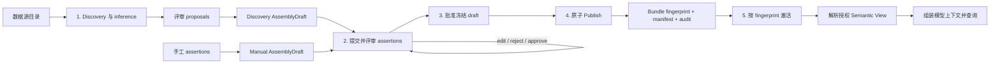

# 从数据源元数据到激活的语义 Bundle

> **读者**：应用负责人、数据治理人员和平台运维人员。
> **前置阅读**：[安装](../getting-started/installation.zh-CN.md) 与
> [架构总览](../architecture/overview.zh-CN.md)。
>
> [English source / 英文规范原文](metadata-to-bundle.md)
>
> **本页为简体中文翻译**。规范语言为英文；如与[英文原文](metadata-to-bundle.md)冲突，
> 以英文为准。

本指南回答四个实际问题：

- 哪些步骤只在首次接入或变更时执行？
- 哪一步需要人工决策？
- 当前实现把快照和 Bundle 存在哪里？
- 查询时如何引用已激活的结果？

## 生命周期



前四步属于**控制面流程**，用于生成可供多次查询复用的、版本化的语义资产，
通常不会随着每条用户问题重复执行。

## 是否需要 UI 或 API？

当前 core library 不提供管理 UI、HTTP server 或 REST API。它是可嵌入的 Python
runtime，因此控制面入口由 Host 应用负责。单个团队可以使用内部 CLI 或 Python
任务；需要自动化时可以提供 service API；如果业务人员需要审核业务含义，则适合
增加数据 steward 使用的管理 UI。

推荐由 Host 在 core contract 之上提供控制面：

| 控制面动作 | 适合的入口 | 对应 core 操作 |
| --- | --- | --- |
| 启动有界 discovery | CLI、定时任务或 service API | discovery 与 `SnapshotLedger.register` |
| 查看 proposals | UI 或 review API | 读取 `SemanticProposalSet` |
| 创建 assembly draft | CLI、UI 或 service API | `create_discovery_draft` 或 `create_manual_draft` |
| 评审 assertions | UI 或受保护的 review API | `submit_for_review`、`decide_assertion`、`edit_assertion` |
| 批准 draft | 受保护的 approval API | 使用当前 `draft_revision` 调用 `approve_draft` |
| 发布/激活/回滚 | 受保护的 admin API 或 release pipeline | `publish_assembly`、`activate_fingerprint`、`rollback_to_fingerprint` |
| 查询时解析 | 应用 runtime | `ViewRegistry.resolve` |

Review 和 activation endpoint 必须认证操作人员，强制 tenant/source scope，记录批准与
发布证据，不能把客户端提交的 authorization claim 当作可信上下文。UI 只是控制面的
面向人的投影，不能替代 core 的校验和 fail-closed 闸门。

## 1. Discovery：取得技术事实

Host 选择数据源、allowlist、租户 scope 和有界 discovery 配置。
`SqlMetadataDiscoverer` 或 `MongoMetadataDiscoverer` 使用只读身份读取结构元数据，
返回不可变的 `MetadataSnapshot`。

快照可以包含表/集合名、字段或路径、规范化类型、关系、受保护的有界统计信息、
新鲜度、完整性、来源信息和 canonical fingerprint。它不能包含凭据、连接字符串、
原生客户端、原始行/文档或不受限制的样本值。

**人工工作**：选择数据源和 allowlist、设置 discovery 边界，并提供可信的租户/数据源授权。
当 Schema 变化或快照过期时，Host 可以再次执行 discovery。

**存储位置**：当前参考实现使用由 Host 管理、进程内的 `SnapshotLedger`。
`register(snapshot, ...)` 将快照作为 inactive evidence 保留；
`active(source_id, tenant_scope_fingerprint)` 读取当前激活快照。
它不是自动写入 PostgreSQL 的持久化层。

## 2. Semantic inference：提出业务语义

`infer_proposals(snapshot, ...)` 根据快照产生有界 proposals，例如：

- 业务实体和字段
- 关系和数据粒度
- 指标及聚合方式
- 别名/同义词和分类

每个 proposal 都携带源快照 fingerprint、`declared` / `observed` / `inferred` 信任级别、
证据、推断方法、必要时的置信度以及新鲜度。推断只是辅助，不是权威。

**人工工作**：初始 proposals 通常可由程序生成，但数据 steward 应在批准前检查它们。
如果技术字段名对应的业务含义不正确，可以拒绝或修订 proposal。

## 3. Assembly / review / approval：人工检查点

Proposal review 只决定哪些 discovery 候选可以进入 assembly，并不授予发布权。
`create_discovery_draft(...)` 把已批准 proposals 适配为待评审的
`SemanticAssertion`；手工 bundle-as-code 使用 `create_manual_draft(...)`，
两条路径最终得到相同的 `AssemblyDraft`。二者都必须声明
`apiVersion: nl2data.io/semantic-assembly/v1alpha1`，且发布前都没有语义 Bundle
fingerprint。

Author 使用 `submit_for_review(...)` 提交 draft。Reviewer 按数据源和业务语义
逐项处理 assertion：

- `approve`：把决定绑定到 assertion 的 canonical payload hash
- `reject`：保留有界负面证据，但从已接受语义载荷中排除
- `edit`：把责任转为 manual provenance，并让变更后的 assertion 回到 `pending`
    以重新决策

Assertion ID 来自按类型定义的身份语义。身份稳定时修改 payload 会被视为 modified，
并使旧 review binding 失效；修改身份则是 delete/add。每次 edit、review、approval 与
publish 都必须提交观察到的 `draft_revision`，过期客户端只会得到 conflict，不会覆盖
更新内容。LLM-suggested 或高置信 assertion 也必须经过显式授权评审。

全部 assertions 都有有效的 approved 或 rejected binding 后，Approver 调用
`approve_draft(...)`，将语义内容冻结在 `approved` 状态。Host policy 分别提供
Author、Reviewer、Approver、Publisher 角色；如启用单人模式豁免，publish audit 会记录它。

## 4. Publish / activate：程序化闸门

`publish_assembly(...)` 是唯一会发射 `SemanticModelBundle` 并让其语义 fingerprint
对外可见的转换。它校验预期 draft revision 与 approved 状态，重新执行 Bundle 和
calculated-field 校验，发射 canonical semantic content，派生并验证 accepted-assertion
manifest，检测相同内容，并以一个事务写入不可变 Bundle、manifest、publish audit 与
supersession edge。失败时 draft 保持 approved 以供重试，不会暴露部分 publication。

Manifest 以 Bundle fingerprint 为键，只含 accepted assertion 的 ID、type、canonical
payload 与 payload hash，用于后续 rediscovery 对齐，但不进入 Bundle fingerprint domain。
Publish audit 只含有界的 approval、provenance、verification、idempotency 与已打码的
deployment-binding 摘要。

激活是按已发布 fingerprint 进行的独立指针切换：

```python
outcome = publish_assembly(approved_draft, ...)
published = outcome.bundle
assert published is not None

catalog.activate_fingerprint(
    published.bundle_id,
    published.fingerprint,
    production=production_context,
)
active = catalog.active(published.bundle_id)
```

等价语义内容按 fingerprint 幂等，复用已有 publication 与 audit reference。同名 Bundle
的不同内容会追加不可变 supersession version。Production activation 还会校验当前 discovery
snapshot、tenant/source scope、新鲜度、完整性、drift 与依赖 fingerprint。回滚使用
`rollback_to_fingerprint(...)`，只移动 active 指针，绝不重新发布或修改任一 artifact。

**人工工作**：批准语义变更，并按 Host 的变更管理流程批准发布。结构和兼容性校验由运行时
和 catalog 完成，人工不能绕过这些检查。

**存储位置**：`InMemoryAssemblyDraftStore` 与 `InMemorySemanticBundleCatalog` 是有界的
进程内参考实现。`nl2data-semantic-catalog-postgres` 提供持久化 draft revision、不可变
Bundle/manifest/audit、supersession chain、active pointer 与 rollback history。它不同于
保存查询 workflow state 的 `nl2data-workflow-postgres`。

## 查询如何引用结果

查询不会把原始 snapshot 或 proposal set 直接交给模型。Host 将 active Bundle 绑定到
`ViewRegistry`，然后使用包含可信租户 scope、当前 Bundle fingerprint 和兼容 snapshot fingerprint
的上下文解析 View。

```python
registry = ViewRegistry(
    descriptors=(descriptor,),
    views=(view_definition,),
    bundle=catalog.active("sales-semantic-model"),
)
resolved = registry.resolve("sales", trusted_resolution_context)
```

解析出来的 View 是授权后的投影。核心层据此组装 `ModelInstructionBundle`；可选模型提供方只会
看到有界语义上下文，不会看到数据库客户端或原始 catalog。模型产生结构化 intent 后，系统再
将其转换为 `SemanticQueryIR`，进行验证、编译、治理、授权和执行。

Bundle 或 snapshot fingerprint 不匹配时，解析或激活会 fail closed，防止 Schema、策略、租户或
Bundle 上下文变化后继续使用旧语义定义。

## 从解析后的 View 到 CompositionProfile

解析后的投影（projection）是流程交给应用运行时的查询期产物。Host 将其折叠进 `NL2Data` facade
使用的公开 `CompositionProfile`：

| Profile 字段 | 来源 | 说明 |
| --- | --- | --- |
| `view` | `AuthorizedView.from_projection(projection)` | 携带 `source_id`、`root_entity_ids`、`field_ids` 以及绑定的 `view_id`/`view_version`/`view_fingerprint`（即投影 fingerprint） |
| `projection` | 解析得到的 `ResolvedViewProjection` | 把 Bundle 身份与 fingerprint 绑定进编译、授权与结果血缘证据；运行时据此自动推导授权视图和语义引用 |
| `adapter` | Host 构建，与 discovery 边界一致 | `allowed_objects`/`allowed_columns` 应与快照 allowlist 一致 |
| `policy_scope` | Host 自有治理 | 必须先于解析存在：其 `policy_fingerprint` 即视图的 `bound_policy_fingerprint`；`resource_ids` 使用物理对象名 |
| `binding` | Host 自有，来自 discovery 快照或源配置 | Bundle descriptor 只含语义信息，物理名从不进入其中 |
| `tenant_context` | Host 自有可信 scope | 其 `scope_fingerprint` 是解析的闸门（`bound_tenant_scope_fingerprint`） |

顺序很重要：租户 scope 与 policy scope 必须先于视图解析存在，因为它们的 fingerprint 是
`ResolutionContext` 的输入。物理 binding 和 adapter 与 Bundle 无关。

```python
from nl2data import CompositionProfile, NL2Data
from nl2data_core.planning.validation import AuthorizedView

# policy 与 tenant 先行：它们的 fingerprint 是视图解析的输入
projection = registry.resolve("sales_view", trusted_resolution_context).projection

profile = CompositionProfile(
    provider=model_provider,
    adapter=query_adapter,
    policy_scope=policy_scope,                      # resource_ids = 物理对象名
    view=AuthorizedView.from_projection(projection),
    projection=projection,                          # 全链路 Bundle 证据
    binding=physical_binding,                       # 物理名，Host 自有
    plan_resolver=plan_resolver,
    state_store=state_store,
    tenant_context=scope,
)

facade = NL2Data(composition=profile)
```

绑定 `projection` 后，运行时自动从投影推导授权视图与语义引用，所有证据记录（checkpoint、授权、
结果血缘）都携带解析视图 fingerprint 与 Bundle 身份；不绑定时，Host 必须自行构建 `view` 与
`semantic_references`，Bundle 身份只能通过视图 fingerprint 间接承诺。

## 哪些变化会重新触发流程？

| 变化 | 从哪一步重新开始 | 典型动作 |
| --- | --- | --- |
| 新表/字段或类型变化 | Discovery | 注册新快照并比较 drift |
| 新业务定义或别名 | Draft/review | 修改 assertion，并重新建立已失效的 review binding |
| 已批准的语义模型发布 | Publish | 发布新的不可变 Bundle 与 supersession edge |
| 部署发布 | Activate | 通过校验后切换 active 指针 |
| 不同租户或用途 | View resolution | 解析不同的授权 View |
| 新的自然语言问题 | Query intent | 为本次请求组装上下文并识别 intent |

多进程生产部署应使用 PostgreSQL semantic catalog，或提供具备相同 revision 校验、发布事务、
fingerprint 身份、授权与 fail-closed 语义的共享实现，不能把进程内内存当作生产数据库。

## 相关页面

- [元数据生命周期](../architecture/metadata-lifecycle.md) — 契约与 drift policy
- [语义层](../architecture/semantic-layer.zh-CN.md) — 描述符、视图、投影与多根数据源
- [CompositionProfile 参考](../reference/composition-profile.zh-CN.md) — 每个 profile 字段及示例
- [证据与指纹](../architecture/evidence-and-fingerprints.zh-CN.md) — 安全 identity 引用
- [服务配置](../operations/services.md) — 数据源连接 profile
