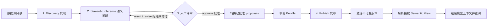

# 从数据源元数据到激活的语义 Bundle

> **读者**：应用负责人、数据治理人员和平台运维人员。
> **前置阅读**：[安装](../getting-started/installation.zh-CN.md) 与
> [架构总览](../architecture/overview.zh-CN.md)。
>
> [English source / 英文规范原文](metadata-to-bundle.md)
>
> **本页为简体中文翻译**。规范语言为英文；如与[英文原文](metadata-to-bundle.md)冲突，
> 以英文为准。

本指南回答四个实际问题：

- 哪些步骤只在首次接入或变更时执行？
- 哪一步需要人工决策？
- 当前实现把快照和 Bundle 存在哪里？
- 查询时如何引用已激活的结果？

## 生命周期



前四步属于**控制面流程**，用于生成可供多次查询复用的、版本化的语义资产，
通常不会随着每条用户问题重复执行。

## 是否需要 UI 或 API？

当前 core library 不提供管理 UI、HTTP server 或 REST API。它是可嵌入的 Python
runtime，因此控制面入口由 Host 应用负责。单个团队可以使用内部 CLI 或 Python
任务；需要自动化时可以提供 service API；如果业务人员需要审核业务含义，则适合
增加数据 steward 使用的管理 UI。

推荐由 Host 在 core contract 之上提供控制面：

| 控制面动作 | 适合的入口 | 对应 core 操作 |
| --- | --- | --- |
| 启动有界 discovery | CLI、定时任务或 service API | discovery 与 `SnapshotLedger.register` |
| 查看 proposals | UI 或 review API | 读取 `SemanticProposalSet` |
| 批准/拒绝/修订 | UI 或受保护的 review API | proposal-set review methods |
| 构建并校验 Bundle | service job 或 release pipeline | `convert_approved_proposals` 与 Bundle validation |
| 发布/激活/回滚 | 受保护的 admin API 或 release pipeline | `catalog.publish`、`.activate`、`.rollback` |
| 查询时解析 | 应用 runtime | `ViewRegistry.resolve` |

Review 和 activation endpoint 必须认证操作人员，强制 tenant/source scope，记录批准与
发布证据，不能把客户端提交的 authorization claim 当作可信上下文。UI 只是控制面的
面向人的投影，不能替代 core 的校验和 fail-closed 闸门。

## 1. Discovery：取得技术事实

Host 选择数据源、allowlist、租户 scope 和有界 discovery 配置。
`SqlMetadataDiscoverer` 或 `MongoMetadataDiscoverer` 使用只读身份读取结构元数据，
返回不可变的 `MetadataSnapshot`。

快照可以包含表/集合名、字段或路径、规范化类型、关系、受保护的有界统计信息、
新鲜度、完整性、来源信息和 canonical fingerprint。它不能包含凭据、连接字符串、
原生客户端、原始行/文档或不受限制的样本值。

**人工工作**：选择数据源和 allowlist、设置 discovery 边界，并提供可信的租户/数据源授权。
当 Schema 变化或快照过期时，Host 可以再次执行 discovery。

**存储位置**：当前参考实现使用由 Host 管理、进程内的 `SnapshotLedger`。
`register(snapshot, ...)` 将快照作为 inactive evidence 保留；
`active(source_id, tenant_scope_fingerprint)` 读取当前激活快照。
它不是自动写入 PostgreSQL 的持久化层。

## 2. Semantic inference：提出业务语义

`infer_proposals(snapshot, ...)` 根据快照产生有界 proposals，例如：

- 业务实体和字段
- 关系和数据粒度
- 指标及聚合方式
- 别名/同义词和分类

每个 proposal 都携带源快照 fingerprint、`declared` / `observed` / `inferred` 信任级别、
证据、推断方法、必要时的置信度以及新鲜度。推断只是辅助，不是权威。

**人工工作**：初始 proposals 通常可由程序生成，但数据 steward 应在批准前检查它们。
如果技术字段名对应的业务含义不正确，可以拒绝或修订 proposal。

## 3. Review / approval：主要人工检查点

这是需要明确人工或等价治理批准的阶段。评审人依据数据源和业务语义逐项处理 proposal：

- `approve`：允许转换为 Bundle 输入
- `reject`：排除该 proposal
- `revise`：旧 proposal 被替代，新 proposal 仍为 `PENDING`，必须再次批准

`SemanticProposalSet.approve(...)`、`.reject(...)` 和 `.revise(...)` 返回新的不可变集合。
未知 proposal ID 会报错；评审不能静默跳过目标。未经批准的 inferred 或 observed 事实不能
自行授予 View 可见性、租户访问权、强制过滤条件或执行授权。

生产流程还应由 Host 记录批准者、批准时间和被评审的 snapshot fingerprint。核心模型保留
安全的 provenance 引用，人工身份和审批系统由外围 Host 管理。

## 4. Convert / publish / activate：程序化闸门

`convert_approved_proposals(...)` 只把 `APPROVED` proposals 转换成 Bundle 输入。没有任何已批准
proposal 时不会产生输入。源 snapshot fingerprint 和 proposal references 会继续保留，避免
过期评审被误当成当前元数据。

Host 随后构造并校验 `SemanticModelBundle`。校验包括结构、交叉引用、版本、源兼容性、信任与
proposal 引用、有界限制和不安全内容。通过校验后调用：

```python
catalog.publish(bundle, production=production_context)
catalog.activate(bundle.bundle_id, bundle.model_version,
                 production=production_context)
active = catalog.active(bundle.bundle_id)
```

`publish` 保存不可变版本，但不会自动激活；重复版本会被拒绝。提供 production context 时，
还会校验当前 discovery snapshot、租户/数据源 scope、新鲜度、完整性和 drift policy；依赖的
Bundle 也必须已发布且 fingerprint 匹配。

激活是一次原子指针切换。候选 Bundle 被拒绝时，原有 active Bundle 保持不变。回滚只是把
active 指针切回之前有效的不可变版本，不修改旧 artifact。

**人工工作**：批准语义变更，并按 Host 的变更管理流程批准发布。结构和兼容性校验由运行时
和 catalog 完成，人工不能绕过这些检查。

**存储位置**：当前提供的 `InMemorySemanticBundleCatalog` 是有界的进程内参考 catalog，
在内存中保存不可变 publication、active 指针和激活历史。当前 core 没有自动提供共享的持久化
Bundle catalog。不要把它和 `nl2data-workflow-postgres` 的 `PostgreSQLStateStore` 混淆，后者保存的是 workflow state 和幂等记录。

## 查询如何引用结果

查询不会把原始 snapshot 或 proposal set 直接交给模型。Host 将 active Bundle 绑定到
`ViewRegistry`，然后使用包含可信租户 scope、当前 Bundle fingerprint 和兼容 snapshot fingerprint
的上下文解析 View。

```python
registry = ViewRegistry(
    descriptors=(descriptor,),
    views=(view_definition,),
    bundle=catalog.active("sales-semantic-model"),
)
resolved = registry.resolve("sales", trusted_resolution_context)
```

解析出来的 View 是授权后的投影。核心层据此组装 `ModelInstructionBundle`；可选模型提供方只会
看到有界语义上下文，不会看到数据库客户端或原始 catalog。模型产生结构化 intent 后，系统再
将其转换为 `SemanticQueryIR`，进行验证、编译、治理、授权和执行。

Bundle 或 snapshot fingerprint 不匹配时，解析或激活会 fail closed，防止 Schema、策略、租户或
Bundle 上下文变化后继续使用旧语义定义。

## 哪些变化会重新触发流程？

| 变化 | 从哪一步重新开始 | 典型动作 |
| --- | --- | --- |
| 新表/字段或类型变化 | Discovery | 注册新快照并比较 drift |
| 新业务定义或别名 | Inference/review | 修订或添加 proposal，再批准 |
| 已批准的语义模型发布 | Convert/publish | 发布新的不可变 Bundle 版本 |
| 部署发布 | Activate | 通过校验后切换 active 指针 |
| 不同租户或用途 | View resolution | 解析不同的授权 View |
| 新的自然语言问题 | Query intent | 为本次请求组装上下文并识别 intent |

Discovery 和 Bundle 的持久化是 Host 管理的扩展点。多进程生产部署应提供具备相同 fingerprint、
授权、原子激活和 fail-closed 语义的共享实现，不能把进程内内存当作生产数据库。

## 相关页面

- [元数据生命周期](../architecture/metadata-lifecycle.md) — 契约与 drift policy
- [证据与指纹](../architecture/evidence-and-fingerprints.zh-CN.md) — 安全 identity 引用
- [服务配置](../operations/services.md) — 数据源连接 profile
